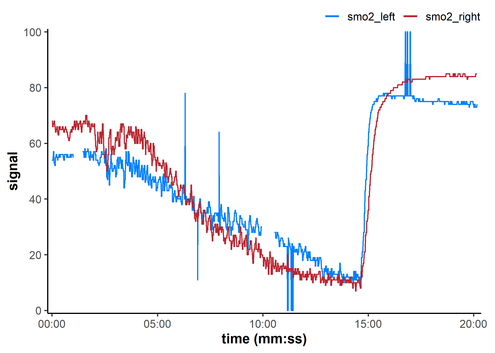
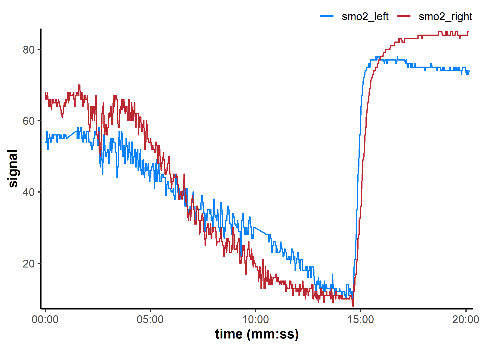
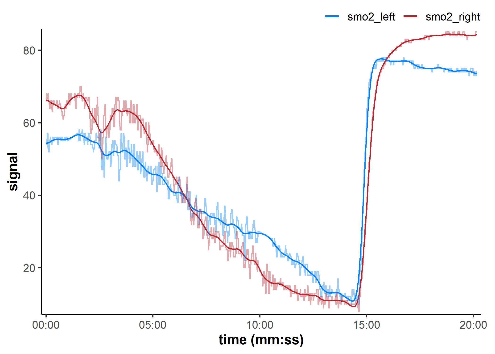
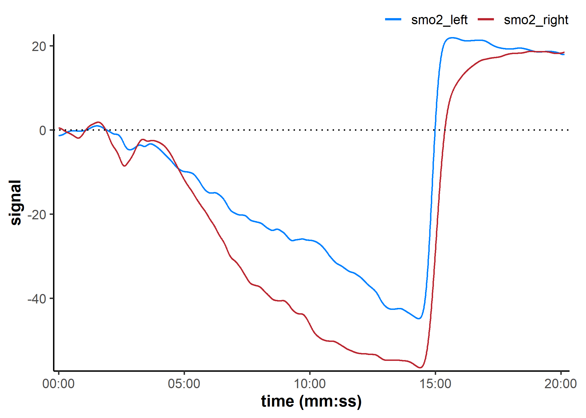
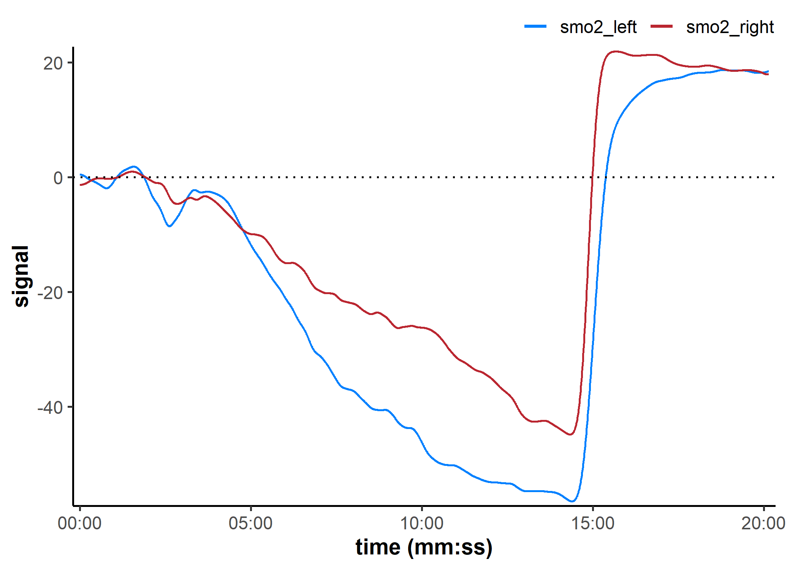
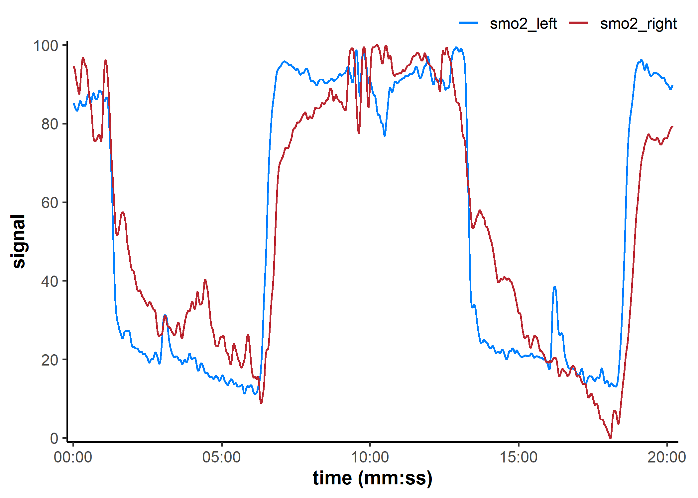
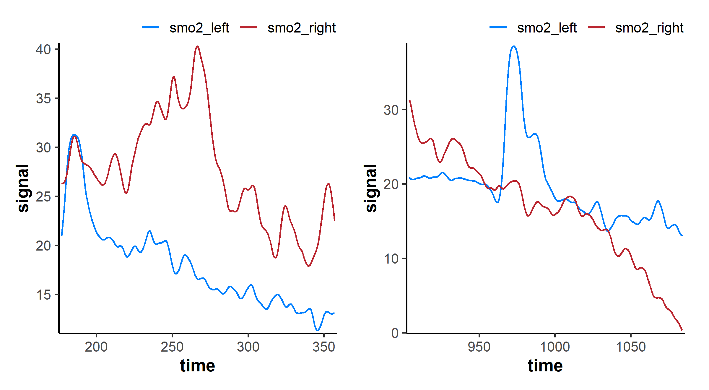
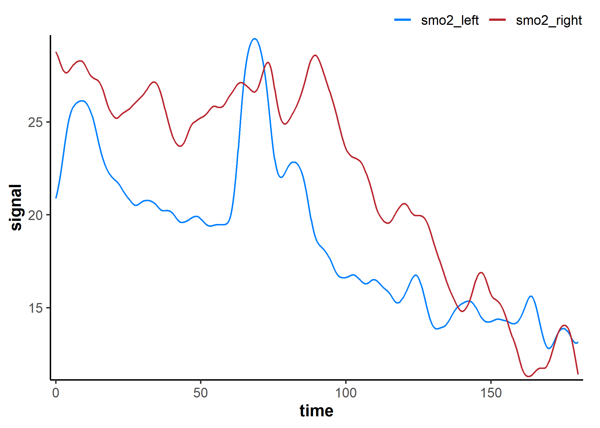

<!-- README.md is generated from README.Rmd. Please edit that file -->

# mnirs <a href="https://jemarnold.github.io/mnirs/"></a>

<!-- badges: start -->

[](https://lifecycle.r-lib.org/articles/stages.html#experimental)
[](https://github.com/jemarnold/mnirs/actions/workflows/R-CMD-check.yaml)
[](https://app.codecov.io/gh/jemarnold/mnirs)
<!-- badges: end -->

*{mnirs}* contains standardised, reproducible methods for reading,
processing, and analysing data from muscle near-infrared spectroscopy
(mNIRS) devices. Intended for mNIRS researchers and practitioners in
exercise physiology, sports science, and clinical rehabilitation with
minimal coding experience required.

## Installation

You can install the development version of *{mnirs}* from
[GitHub](https://github.com/jemarnold/mnirs) with:

``` r
# install.packages("remotes")
remotes::install_github("jemarnold/mnirs")
```

## Citation

`<coming soon>`

## Online App

A very basic implementation of this package is hosted at
<https://jem-arnold.shinyapps.io/mnirs/> and can currently be used for
reading and pre-processing mNIRS data.

[](https://jemarnold-mnirs-app.share.connect.posit.cloud/)

## Usage

A more detailed vignette for common usage can be found here: [Reading
and Cleaning Data with
{mnirs}](https://jemarnold.github.io/mnirs/articles/reading-mnirs-data.html)

*{mnirs}* is currently in experimental development and functionality may
change! Stay updated on development and follow releases at
[github.com/jemarnold/mnirs](https://github.com/jemarnold/mnirs).

*{mnirs}* is designed to process NIRS data, but it can be used to read,
clean, and process other time series datasets which require many of the
same processing steps. Enjoy!

### `read_mnirs()` Read data from file

``` r
# remotes::install_github("jemarnold/mnirs") ## install development version
library(ggplot2) ## load for plotting
library(mnirs)

## {mnirs} includes sample files from a few mNIRS devices
example_mnirs()
#> [1] "artinis_intervals.xlsx"  "moxy_intervals.csv"     
#> [3] "moxy_ramp.xlsx"          "portamon-oxcap.xlsx"    
#> [5] "train.red_intervals.csv"

## rename channels in the format `renamed = "original_name"`
## where "original_name1" should match the file column name exactly
data_table <- read_mnirs(
    file_path = example_mnirs("moxy_ramp"), ## call an example data file
    nirs_channels = c(
        smo2_left = "SmO2 Live",            ## identify and rename channels
        smo2_right = "SmO2 Live(2)"
    ),
    time_channel = c(time = "hh:mm:ss"),    ## date-time format will be converted to numeric
    event_channel = NULL,                   ## leave blank if unused
    sample_rate = NULL,                     ## if blank, will be estimated from time_channel
    add_timestamp = FALSE,                  ## omit a date-time timestamp column
    zero_time = TRUE,                       ## recalculate time values from zero
    keep_all = FALSE,                       ## return only the specified data channels
    verbose = TRUE                          ## show warnings & messages
)
#> ! Estimated `sample_rate` = 2 Hz.
#> ℹ Define `sample_rate` explicitly to override.
#> Warning: ! Duplicate or irregular `time_channel` samples detected.
#> ℹ Investigate at `time` = 211.99 and 1184.
#> ℹ Re-sample with `mnirs::resample_mnirs()`.

## Note the above info message that sample_rate was estimated correctly at 2 Hz 👆
## ignore the warnings about irregular sampling for now, we will resample later

data_table
#> # A tibble: 2,203 × 3
#>     time smo2_left smo2_right
#>    <dbl>     <dbl>      <dbl>
#>  1 0            54         68
#>  2 0.400        54         68
#>  3 0.960        54         68
#>  4 1.51         54         66
#>  5 2.06         54         66
#>  6 2.61         54         66
#>  7 3.16         54         66
#>  8 3.71         57         67
#>  9 4.26         57         67
#> 10 4.81         57         67
#> # ℹ 2,193 more rows

## note the `time_labels` plot argument to display time values as `h:mm:ss`
plot(
    data_table,
    time_labels = TRUE,
    n.breaks = 5,
    na.omit = FALSE
)
```



### Metadata stored in `mnirs` data frames

``` r
## view metadata (omitting item two, a list of row numbers)
attributes(data_table)[-2]
#> $class
#> [1] "mnirs"      "tbl_df"     "tbl"        "data.frame"
#> 
#> $names
#> [1] "time"       "smo2_left"  "smo2_right"
#> 
#> $nirs_device
#> [1] "Moxy"
#> 
#> $nirs_channels
#> [1] "smo2_left"  "smo2_right"
#> 
#> $time_channel
#> [1] "time"
#> 
#> $sample_rate
#> [1] 2
#> 
#> $start_timestamp
#> [1] "2026-03-17 00:29:00 PDT"
```

### `replace_mnirs`: Replace local outliers, invalid values, and missing values

``` r
data_cleaned <- replace_mnirs(
    data_table,         ## blank channels will be retrieved from metadata
    invalid_values = 0, ## known invalid values in the data
    invalid_above = 90, ## remove data spikes above 90
    outlier_cutoff = 3, ## recommended default value
    width = 10,         ## window to detect and replace outliers/missing values
    method = "linear"   ## linear interpolation over `NA`s
)

plot(data_cleaned, time_labels = TRUE)
```



### `resample_mnirs()`: Resample data

``` r
data_resampled <- resample_mnirs(
    data_cleaned,      ## blank channels will be retrieved from metadata
    resample_rate = 2, ## blank by default will resample to `sample_rate`
    method = "linear"  ## linear interpolation across resampled indices
)
#> ℹ Output is resampled at 2 Hz.

## note the altered "time" values from the original data frame 👇
data_resampled
#> # A tibble: 2,419 × 3
#>     time smo2_left smo2_right
#>    <dbl>     <dbl>      <dbl>
#>  1   0        54         68  
#>  2   0.5      54         68  
#>  3   1        54         67.9
#>  4   1.5      54         66.0
#>  5   2        54         66  
#>  6   2.5      54         66  
#>  7   3        54         66  
#>  8   3.5      55.9       66.6
#>  9   4        57         67  
#> 10   4.5      57         67  
#> # ℹ 2,409 more rows
```

### `filter_mnirs()`: Digital filtering

``` r
data_filtered <- filter_mnirs(
    data_resampled,         ## blank channels will be retrieved from metadata
    method = "butterworth", ## Butterworth digital filter is a common choice
    order = 2,              ## filter order number
    W = 0.02,               ## filter fractional critical frequency `[0, 1]`
    type = "low",           ## specify a "low-pass" filter
    na.rm = TRUE            ## explicitly preserve NAs
)

## we will add the non-filtered data back to the plot to compare
plot(data_filtered, time_labels = TRUE) +
    geom_line(
        data = data_cleaned, 
        aes(y = smo2_left, colour = "smo2_left"), alpha = 0.4
    ) +
    geom_line(
        data = data_cleaned, 
        aes(y = smo2_right, colour = "smo2_right"), alpha = 0.4
    )
```



### `shift_mnirs()` & `rescale_mnirs()`: Shift and rescale data

``` r
data_shifted <- shift_mnirs(
    data_filtered,     ## un-grouped nirs channels to shift separately 
    nirs_channels = list(smo2_left, smo2_right), 
    to = 0,            ## NIRS values will be shifted to zero
    span = 120,        ## shift the *first* 120 sec of data to zero
    position = "first"
)

plot(data_shifted, time_labels = TRUE) +
    geom_hline(yintercept = 0, linetype = "dotted")
```



``` r
data_rescaled <- rescale_mnirs(
    data_filtered,    ## un-grouped nirs channels to rescale separately 
    nirs_channels = list(smo2_left, smo2_right), 
    range = c(0, 100) ## rescale to a 0-100% functional exercise range
)

plot(data_rescaled, time_labels = TRUE) +
    geom_hline(yintercept = c(0, 100), linetype = "dotted")
```



### Pipe-friendly functions

``` r
## global option to silence info & warning messages
options(mnirs.verbose = FALSE)

nirs_data <- read_mnirs(
    example_mnirs("train.red"),
    nirs_channels = c(
        smo2_left = "SmO2 unfiltered",
        smo2_right = "SmO2 unfiltered"
    ),
    time_channel = c(time = "Timestamp (seconds passed)"),
    zero_time = TRUE
) |>
    resample_mnirs() |> ## default settings will resample to the same `sample_rate`
    replace_mnirs(
        invalid_above = 73,
        outlier_cutoff = 3,
        span = 7
    ) |>
    filter_mnirs(
        method = "butterworth",
        order = 2,
        W = 0.02,
        na.rm = TRUE
    ) |>
    shift_mnirs(
        nirs_channels = list(smo2_left, smo2_right), ## 👈 channels grouped separately
        to = 0,
        span = 60,
        position = "first"
    ) |>
    rescale_mnirs(
        nirs_channels = list(c(smo2_left, smo2_right)), ## 👈 channels grouped together
        range = c(0, 100)
    )

plot(nirs_data, time_labels = TRUE)
```



### `extract_intervals()`: detect events and extract intervals

``` r
## return each interval independently with `event_groups = "distinct"`
distinct_list <- extract_intervals(
    nirs_data,                  ## channels blank for "distinct" grouping
    start = by_time(177, 904),  ## manually identified interval start times
    end = by_time(357, 1084),   ## interval end time (start + 180 sec)
    event_groups = "distinct",  ## return a list of data frames for each (2) event
    span = c(0, 0),             ## no modification to the 3-min intervals
    zero_time = FALSE           ## return original time values
)

## use `{patchwork}` package to plot intervals side by side
library(patchwork)

plot(distinct_list[[1L]]) + plot(distinct_list[[2L]])
```



``` r
## ensemble average both intervals with `event_groups = "ensemble"`
ensemble_list <- extract_intervals(
    nirs_data,                  ## channels recycled to all intervals by default
    nirs_channels = c(smo2_left, smo2_right),
    start = by_time(177, 904),  ## alternatively specify start times + 180 sec
    event_groups = "ensemble",  ## ensemble-average across two intervals
    span = c(0, 180),           ## span recycled to all intervals by default
    zero_time = TRUE            ## re-calculate common time to start from `0`
)

plot(ensemble_list[[1L]])
```



## Future *{mnirs}* development

- Process oxygenation kinetics

  - Monoexponential & sigmoidal curve fitting

  - non-parametric kinetics & slope analysis

- Critical oxygenation breakpoint analysis

  - Manual selection and automation-assisted breakpoint detection
    (combine expert evaluation with robust probabilistic breakpoint
    detection)

## mNIRS device compatibility

This package is designed to recognise mNIRS data exported as *.csv* or
*.xls(x)* files. It should be flexible for use with many different NIRS
devices, and compatibility will improve with continued development.

Currently, it has been tested successfully with mNIRS data exported from
the following devices and apps:

- [Artinis](https://www.artinis.com/oxysoft) Oxysoft software (.csv and
  .xlsx)
- [Moxy](https://www.moxymonitor.com/) direct export (.csv)
- [PerfPro](https://perfprostudio.com/) PC software (.xlsx)
- [Train.Red](https://train.red/) app (.csv)
- [VO2 Master Manager](https://vo2master.com/features/) app (.xlsx)

------------------------------------------------------------------------

*Generative chatbots are used to assist with code optimisation. All code
is thoroughly reviewed and validated by the package author.*
