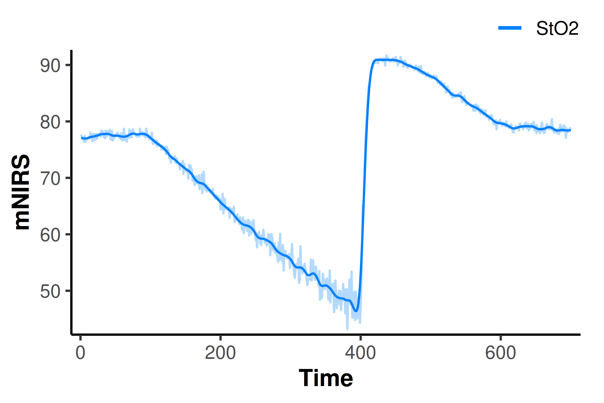
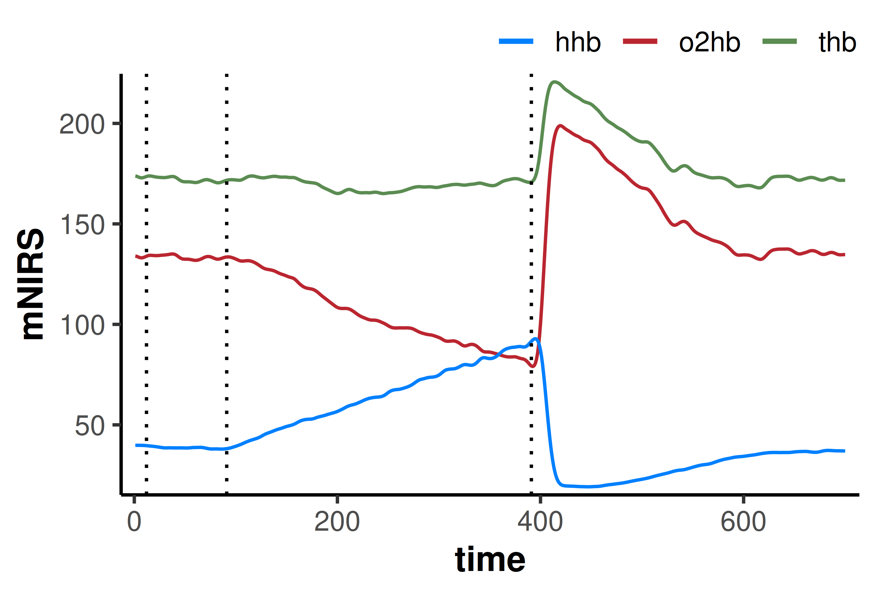
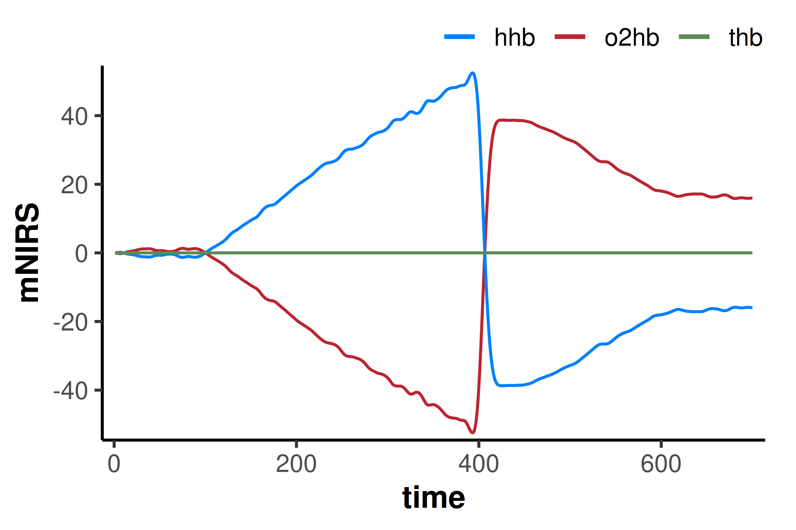
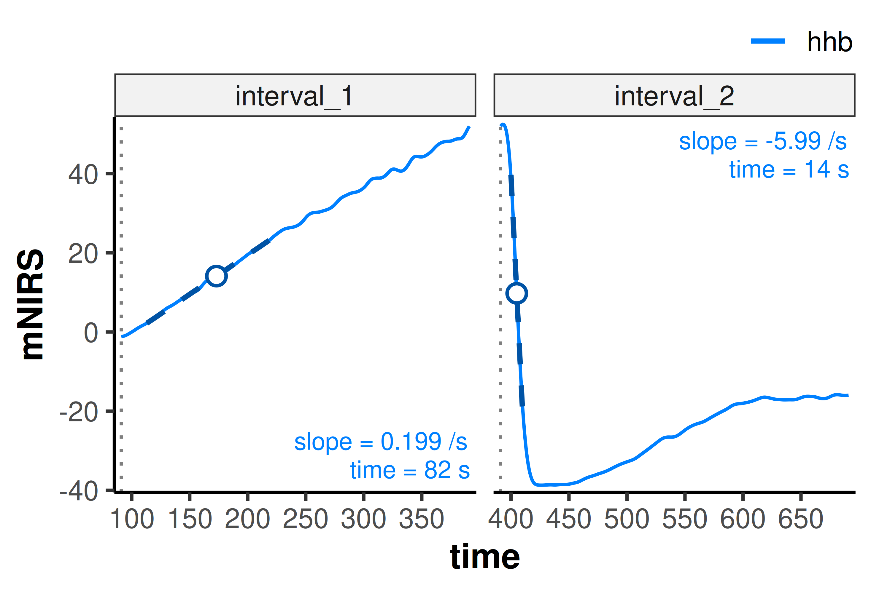
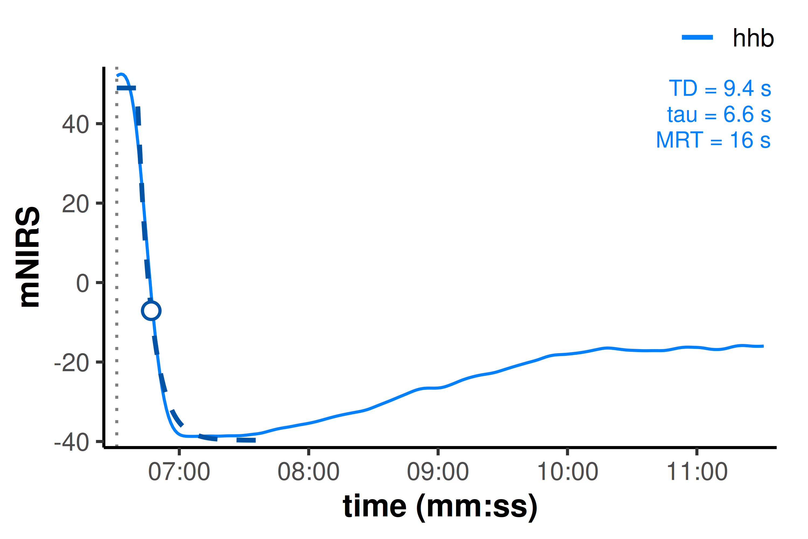
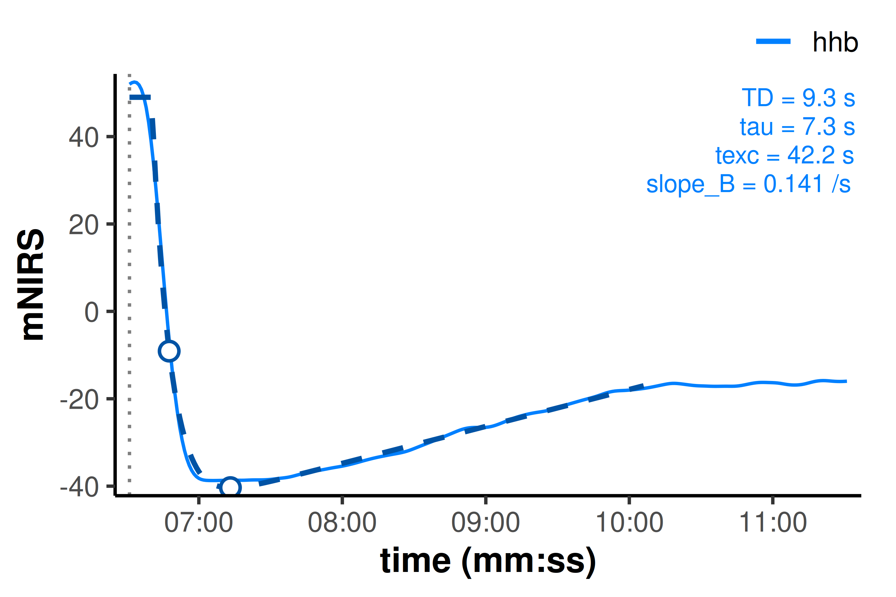
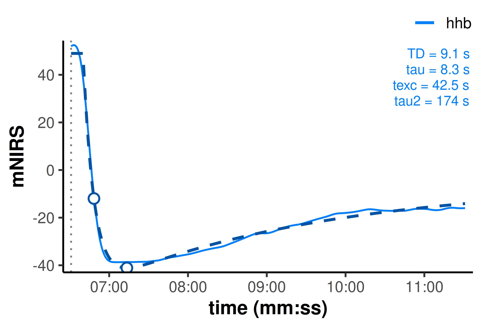

# Reading and analysing PIONIRS data with mnirs

## Introduction

*{mnirs}* can now read *PIONIRS NIRSBOX* `.ftn` and `.ftn2` file exports
directly with
[`read_mnirs()`](https://jemarnold.github.io/mnirs/reference/read_mnirs.md).
This article demonstrates reading both file types and running a short
processing and analysis pipeline on an arterial occlusion recording.

> **Note**
>
> This article assumes basic familiarity with the *{mnirs}* package. See
> [*Reading and Cleaning Data with
> mnirs*](https://jemarnold.github.io/mnirs/articles/reading-mnirs-data.html)
> for an overview.

## Setup

``` r

library(ggplot2) ## for plotting
library(mnirs)   ## install: pak::pak("jemarnold/mnirs@dev")
```

## Automatic `.ftn(2)` file channel detection

*PIONIRS* `.ftn(2)` files are recognised automatically. With no channels
specified,
[`read_mnirs()`](https://jemarnold.github.io/mnirs/reference/read_mnirs.md)
returns `"Time"` as `time_channel`, `"TagLabel"` as `event_channel`, and
any *“StO2”* channels as `nirs_channels`.

When automatically detecting a known NIRS device file format, all
columns are returned to allow exploration of the file.

``` r

## read an example file with no additional parameters
## file paths are hidden for this example
df_sto2 <- read_mnirs(example_mnirs("pionirs"))

print(df_sto2, n = 5)
#> # A tibble: 700 × 15
#>    Time Iteration   Tag TagLabel  StO2 uA_L1 uS_L1 uA_L2 uS_L2 DPF_L1 DPF_L2
#>   <dbl>     <dbl> <dbl> <chr>    <dbl> <dbl> <dbl> <dbl> <dbl>  <dbl>  <dbl>
#> 1     1         1     0 <NA>      77.7 0.307  10.4 0.362 10.2    4.48   4.1 
#> 2     2         2     0 <NA>      77.2 0.308  10.4 0.358  9.87   4.45   4.05
#> 3     3         3     0 <NA>      76.9 0.308  10.5 0.354  9.8    4.47   4.05
#> 4     4         4     0 <NA>      77   0.307  10.5 0.356  9.96   4.48   4.08
#> 5     5         5     0 <NA>      76.4 0.305  10.2 0.346  9.53   4.44   4.03
#> # ℹ 695 more rows
#> # ℹ 4 more variables: O2Hb <dbl>, HHb <dbl>, THb <dbl>, DQI <dbl>
```

### Filtering the data

[`filter_mnirs()`](https://jemarnold.github.io/mnirs/reference/filter_mnirs.md)
applies a digital filter to all `nirs_channels` automatically retrieved
from metadata in the data frame of class *“mnirs”* read above.

Here, a Butterworth low-pass 2nd-order filter with cutoff frequency 0.05
Hz seems to smooth the data sufficiently.

``` r

df_filt <- filter_mnirs(
    df_sto2,
    method = "butterworth",
    order  = 2,
    fc     = 0.05
)

## overlay unfiltered data for comparison
plot(df_filt) +
    geom_line(
        data  = df_sto2,
        aes(y = `StO2`, colour = "StO2"),
        alpha = 0.3
    )
```



## Specify explicit NIRS channels for analysis

Channels can also be specified and renamed explicitly. Since we have
already read the file, we can instead modify channels using
[`create_mnirs_data()`](https://jemarnold.github.io/mnirs/reference/create_mnirs_data.md).
We will specify the raw haemoglobin concentration signals, with the
event column containing manually entered labels.

``` r

df_raw <- create_mnirs_data(
    df_filt,
    nirs_channels = c(o2hb = "O2Hb", hhb = "HHb", thb = "THb"),
    time_channel = c(time = "Time"),
    event_channel = c(labels = "TagLabel")
) |>
    filter_mnirs(method = "butterworth", order = 2, fc = 0.05)

plot(df_raw) +
    geom_vline(
        data = subset(df_raw, !is.na(labels)),
        aes(xintercept = time),
        linetype = "dotted"
    )
```



### Correct for blood volume: Δtotal\[haem\]

[`correct_blood_volume()`](https://jemarnold.github.io/mnirs/reference/correct_blood_volume.md)
normalises oxy-, deoxy-, and total\[haem\] for changes in blood volume
during the occlusion. Channels must be specified explicitly to avoid
naming ambiguity.

``` r

df_corr <- correct_blood_volume(
    df_raw,
    oxy_channel   = o2hb,
    deoxy_channel = hhb,
    total_channel = thb
)

plot(df_corr)
```



### Extract deoxygenation & reoxygenation intervals

[`extract_intervals()`](https://jemarnold.github.io/mnirs/reference/extract_intervals.md)
can locate the labels *“Occlusion start”* and *“Recovery”*. an `end`
value can also be specified, or a timespan (in units of `time_channel`)
can be defined around each detected event label, to return the desired
interval lengths.

O₂ extraction or rate of *mV̇O₂* can be estimated from the peak 120-sec
linear slope during the occlusion deoxygenation (*“slope 1”*).

Reoxygenation kinetics or *microvascular responsiveness* is typically
estimated as the peak 10-sec slope after occlusion (*“slope 2”*), or
with a monoexponential model. We will extract the full reoxygenation and
hyperaemia phase for analysis.

We will isolate the *“deoxy\[haem\]”* channel to analyse, since *“hhb”*
and *“o2hb”* are now mirror images of each other.

``` r

df_list <- extract_intervals(
    df_corr,
    nirs_channels = hhb,
    start = by_label("Occlusion", "Recovery"),
    span  = c(0, 300)
)

print(df_list, n = 5)
#> $interval_1 
#> # A tibble: 301 × 15
#>    time Iteration   Tag labels  StO2 uA_L1 uS_L1 uA_L2 uS_L2 DPF_L1 DPF_L2  o2hb
#>   <dbl>     <dbl> <dbl> <chr>  <dbl> <dbl> <dbl> <dbl> <dbl>  <dbl>  <dbl> <dbl>
#> 1    91        91     1 Occlu…  77.8 0.296  10.3 0.353  9.85   4.51   4.07 1.17 
#> 2    92        92     0 <NA>    77.7 0.302  10.4 0.352  9.95   4.5    4.1  1.11 
#> 3    93        93     0 <NA>    77.7 0.301  10.6 0.350  9.86   4.54   4.09 1.04 
#> 4    94        94     0 <NA>    77.6 0.291  10.1 0.354 10.0    4.49   4.1  0.949
#> 5    95        95     0 <NA>    77.6 0.299  10.4 0.355 10.0    4.5    4.1  0.832
#> # ℹ 296 more rows
#> # ℹ 3 more variables: hhb <dbl>, thb <dbl>, DQI <dbl>
#> 
#> $interval_2 
#> # A tibble: 301 × 15
#>    time Iteration   Tag labels  StO2 uA_L1 uS_L1 uA_L2 uS_L2 DPF_L1 DPF_L2  o2hb
#>   <dbl>     <dbl> <dbl> <chr>  <dbl> <dbl> <dbl> <dbl> <dbl>  <dbl>  <dbl> <dbl>
#> 1   391       391     1 Recov…  46.7 0.538  11.3 0.327  9.58   3.62   4.15 -52.0
#> 2   392       392     0 <NA>    46.5 0.582  12.0 0.323  9.49   3.62   4.15 -52.3
#> 3   393       393     0 <NA>    46.4 0.525  11.0 0.319  9.38   3.61   4.14 -52.5
#> 4   394       394     0 <NA>    46.4 0.561  11.7 0.328  9.7    3.62   4.17 -52.3
#> 5   395       395     0 <NA>    46.7 0.576  11.8 0.321  9.52   3.59   4.16 -51.8
#> # ℹ 296 more rows
#> # ℹ 3 more variables: hhb <dbl>, thb <dbl>, DQI <dbl>
```

## Analyse microvascular responsiveness

### Peak linear regression slope

`analyse_kinetics(method = "peak_slope")` fits a rolling linear
regression algorithm across the full interval, and returns the greatest
(positive or negative, depending on direction) slope centred within the
specified time `span`.

We can specify different `span` parameter for each interval with a named
[`list()`](https://rdrr.io/r/base/list.html).

``` r

result_deoxy <- analyse_kinetics(
    df_list,
    method = "peak_slope",
    span   = list(interval_1 = 120, interval_2 = 10)
) |>
    print()
#> 
#> Peak Linear Response Rate
#>     Model Coefficients:
#>     interval nirs_channels start_time  slope intercept peak_slope_time
#> 1 interval_1           hhb       91.0 0.1987    -2.174              82
#> 2 interval_2           hhb        391 -5.988     93.59              14

plot(result_deoxy)
```



## Analyse reoxygenation kinetics

Now let’s look at some of the more advanced kinetics analysis methods we
can fit during the reoxygenation and hyperaemia window.

### Monoexponential

`method = "monoexponential"` fits an exponential curve to the data.
`end_window = 30` dynamically ends the fitting window at the first peak
or trough (depending on direction) with no more extreme values within 30
sec, avoiding the post-hyperaemic decay toward baseline which is
non-asymptotic and would bias the monoexponential time constant
coefficient.

``` r

result_monoexp <- analyse_kinetics(
    df_list[2],
    method     = "monoexponential",
    end_window = 30  ## includes 30-sec after the first local extrema
) |>
    print()
#> 
#> Monoexponential One-Phase Kinetics
#>     Model Coefficients:
#>     interval nirs_channels start_time     A      B    TD   tau      k   MRT
#> 1 interval_2           hhb        391 48.98 -39.70 9.421 6.563 0.1524 15.98

plot(result_monoexp, time_labels = TRUE)
```



With experimental kinetics analysis methods (still under development and
not yet validated), we can avoid this potential for coefficient bias by
modelling the hyperaemic drift as a secondary linear slope component in
a two-phase *“exponential-linear”* kinetics response.

### Exponential-drift

`method = "exponential_drift"` (or `"exponential_linear"`) fits a linear
slope term after the primary monoexponential response, to separate the
fast reoxygenation phase from the slow hyperaemic drift.

``` r

result_drift <- analyse_kinetics(
    df_list[2],
    method     = "exponential_drift",
    end_window = 180  ## includes more of the hyperaemic response
) |>
    print()
#> 
#> Exponential-Linear Drift Two-Phase Kinetics
#>     Model Coefficients:
#>     interval nirs_channels start_time             model     A      B    TD
#> 1 interval_2           hhb        391 exponential_drift 49.00 -42.91 9.258
#>     tau      k   MRT  texc slope_B
#> 1 7.343 0.1362 16.60 42.21  0.1409

plot(result_drift, time_labels = TRUE)
```



### Biexponential

`method = "biexponential"` is another experimental method which fits a
two-phase response with overlapping fast and slow monoexponential
curves.

``` r

result_biexp <- analyse_kinetics(
    df_list[2],
    method = "biexponential"
    ## `end_window = Inf` by default; fitting to the full data available
) |>
    print()
#> 
#> Biexponential Two-Phase Kinetics
#>     Model Coefficients:
#>     interval nirs_channels start_time         model     A      B    TD   tau
#> 1 interval_2           hhb        391 biexponential 48.98 -50.77 9.112 8.287
#>     MRT  texc     B2  tau2
#> 1 17.40 42.49 -5.639 173.7

plot(result_biexp, time_labels = TRUE)
```



### Compare fit diagnostics

Fit diagnostics are stored in `results$diagnostics` and can be used to
statistically and qualitatively compare between models.

Information criteria (`aic`, `aicc`, `bic`) can be used to compare
between models with different numbers of parameters (`n_params`). Lower
values represent statistically “better” fitting models, after penalising
extra parameters (each criterion uses slightly different weights and may
disagree on marginal differences).

However, in this case, because each model is fit on a different number
of samples (`n_obs`) in addition to parameters, the information criteria
*cannot* be used to statistically conclude better fit.

The other model diagnostics can be used as qualitative comparators, and
the “best” model can be chosen based on physiological expectations,
experimental design, and established validity.

> **Caution**
>
> Two-phase **Exponential-drift** and **Biexponential** kinetics are
> currently experimental methods and have not yet been validated.

``` r

rbind(
    monoexponential   = result_monoexp$diagnostics,
    exponential_drift = result_drift$diagnostics,
    biexponential     = result_biexp$diagnostics
)
#>                     interval nirs_channels n_obs n_params        r2    adj_r2
#> monoexponential   interval_2           hhb    66        4 0.9931830 0.9928532
#> exponential_drift interval_2           hhb   216        5 0.9947398 0.9946401
#> biexponential     interval_2           hhb   301        6 0.9908865 0.9907320
#>                       rmse    cv_rmse      snr       aic      aicc       bic
#> monoexponential   2.724835 0.15514626 21.66407  329.6177  330.6177  340.5660
#> exponential_drift 1.418235 0.05774017 22.78996  775.9280  776.3299  796.1796
#> biexponential     1.617703 0.07245608 20.40315 1157.7672 1158.1495 1183.7170
```

In this example, `r2`, `rmse`, and `snr` (signal-to-noise ratio) suggest
that the biexponential model is not capturing the shape the full
hyperaemic decay and return to baseline, as well as the
exponential-linear drift model over the hyperaemic component alone.

## Acknowledgements

Thanks to *Marianna Neri*, [*Dr. Simone
Porcelli*](https://medicinamolecolare.dip.unipv.it/en/research/research-teams-and-topics/human-physiology/human-integrative-physology-exercise-simone),
and the developers at [*PIONIRS*](https://www.pionirs.com/wp/) for
providing access to these example files to allow me to integrate this
excellent device into *{mnirs}*.
