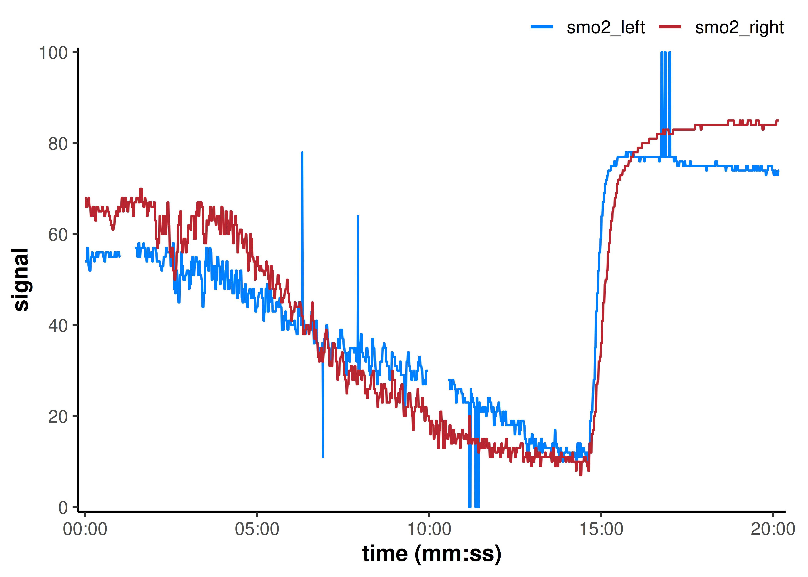
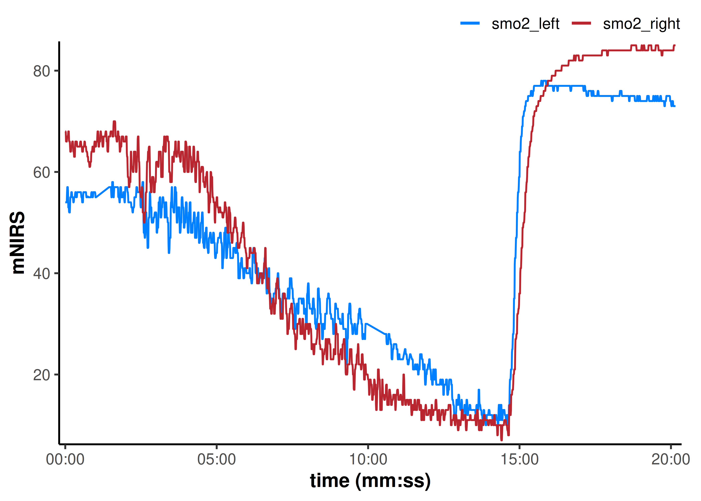
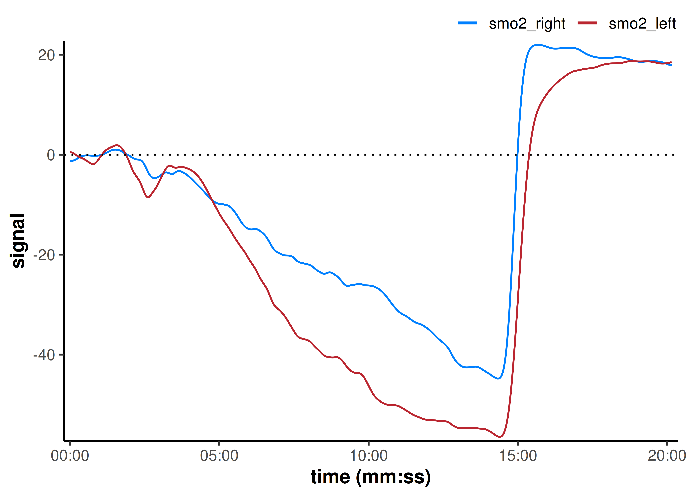
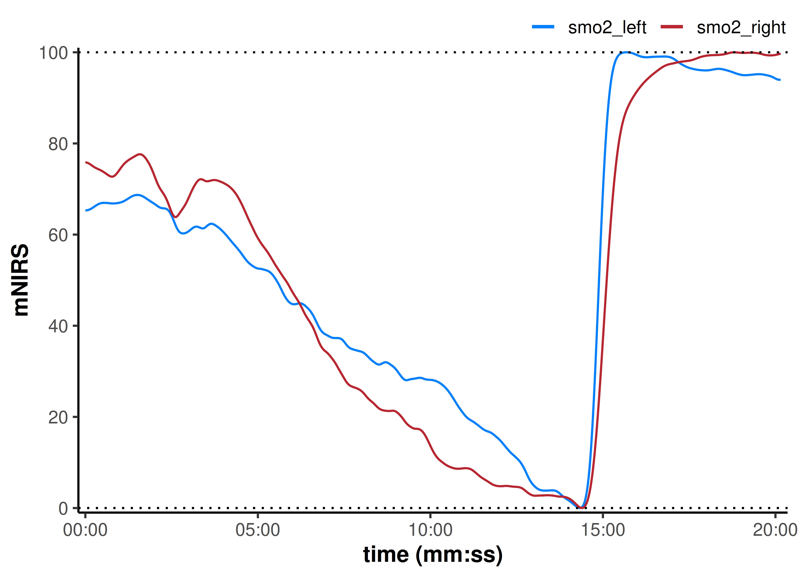
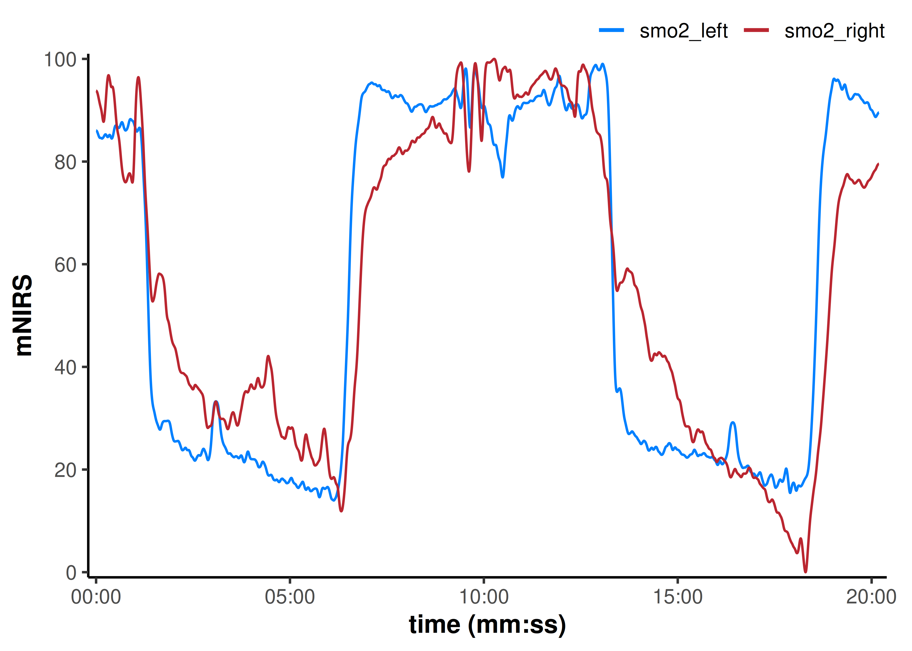
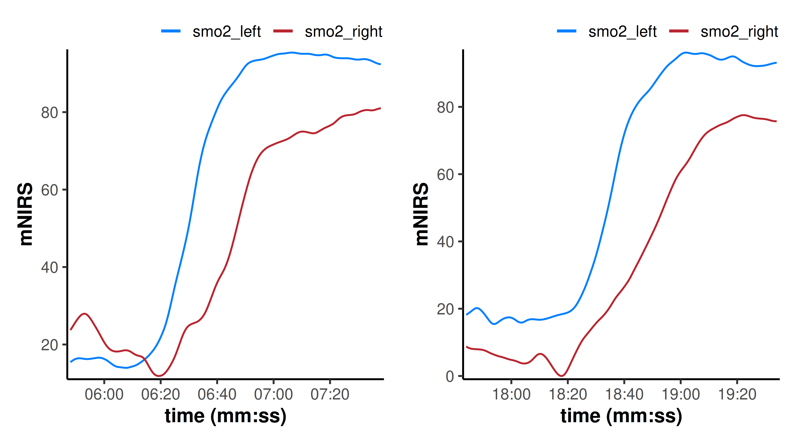

# Reading and Cleaning Data with {mnirs}

## Introduction

Modern wearable **muscle near-infrared spectroscopy (mNIRS)** devices
make it extremely easy to collect local muscle oxygenation data during
dynamic activities. The real challenge comes with deciding how to clean,
filter, process, and eventually interpret those data.

[mnirs](https://jemarnold.github.io/mnirs/) package aims to provide
standardised, reproducible methods for processing and analysing NIRS
data, helping practitioners detect meaningful signals from noise and
improve our confidence in interpreting information and applying that
information back to the clients we work with.

In this vignette we will demonstrate how to:

- 📂 Read data files exported from various wearable NIRS devices and
  import NIRS channels into a standard data frame with metadata, ready
  for further processing.

- 📊 Plot and visualise data frames of class *`"mnirs"`*.

- 🔍 Retrieve metadata stored with data frames of class *`"mnirs"`*.

- 🧹 Detect and replace local outliers, invalid values, and interpolate
  across missing data.

- ⏱️ Re-sample (up- or down-sample) to match the sample rate of other
  recording devices.

- 📈️ Apply digital filtering to optimise signal-to-noise ratio for the
  responses observed in our data.

- ⚖️ Shift and rescale across multiple NIRS channels, to normalise
  signal dynamic range with absolute or relative scaling between muscle
  sites and NIRS channels.

> **Note**
>
> *`mnirs`* is currently [](https://lifecycle.r-lib.org/articles/stages.html#experimental).
> Functionality may change! Stay updated on development and follow
> releases at
> [github.com/jemarnold/mnirs](https://github.com/jemarnold/mnirs).
>
> *{mnirs}* is designed to process mNIRS data, but it can be used to
> read, clean, and pre-process other time series datasets, which require
> many of the same processing steps. Enjoy!

## 📂 Read Data From File

We will read an example data file with two NIRS channels from an
incremental ramp cycling assessment recorded with *Moxy* muscle oxygen
monitor.

First, install and load the *`mnirs`* package and other required
libraries.

*`mnirs`* can be installed with
`remotes::install_github("jemarnold/mnirs")`.

``` r
# remotes::install_github("jemarnold/mnirs") ## install development version
library(ggplot2) ## load for plotting
library(mnirs) 
```

The first function to call will almost always be
[`read_mnirs()`](https://jemarnold.github.io/mnirs/reference/read_mnirs.md).
This is used to read data from *.csv* or *.xls(x)* files exported from
common wearable mNIRS devices. It will extract and return the data table
and metadata for further processing and analysis.

See
[`read_mnirs()`](https://jemarnold.github.io/mnirs/reference/read_mnirs.md)
for more details.

### `read_mnirs()`

- `file_path`

  Specify the location of the NIRS data file, including file extension.
  e.g. `"./my_file.xlsx"` or `"C:/myfolder/my_file.csv"`.

> **Example Data Files**
>
> A few example data files are included in the *`mnirs`* package. File
> paths can be accessed with
> [`example_mnirs()`](https://jemarnold.github.io/mnirs/reference/example_mnirs.md)

- `nirs_channels`

  At least one *NIRS* channel name must be specified from the data table
  in the file. Will accept multiple channel name inputs.

- `time_channel`

  A *time* or *sample* channel name from the data table should also be
  specified explicitly. If left blank, the function will attempt to
  identify the time column automatically.

- `event_channel`

  Optionally we can specify a channel name which indicates *events* or
  *laps* in the data table.

These channel names are used to detect the data table within the file,
and must match exactly with column headers in the file data table. We
can rename these channels when reading data with the format:

``` r
nirs_channels = c(new_name1 = "original_name1", 
                  new_name2 = "original_name2")
```

- `sample_rate`

  The sample rate of the exported data file (in Hz) can either be
  specified explicitly, or it will be estimated from the `time_channel`
  in the data table itself.  
    
  This usually works well unless there is irregular sampling, or the
  `time_channel` is a count of samples rather than a time value, such as
  for data exported from *Oxysoft*. In this case, the function will
  recognise and read the correct sample rate from the file metadata.
  However, in most cases sample_rate should be defined explicitly if
  known.

- `add_timestamp`

  By default, if the `time_channel` is detected as date-time format
  (e.g.; *hh:mm:ss*), it will be converted to numeric time in seconds.
  This logical can specify to add or preserve a timestamp column of
  absolute date-time if detected in the file metadata, or relative
  timestamp if not.

- `zero_time`

  If `time_channel` values start at a non-zero value, this logical can
  specify to re-calculate time starting from zero. If the `time_channel`
  was converted from date-time format, it will always be re-calculated
  from zero.

- `keep_all`

  By default, only the channels specified above will be returned in the
  data table. This logical will return the entire data table as detected
  in the file. Blank/empty columns will be omitted and duplicated or
  invalid column names will be repaired.

- `verbose`

  This and other *`mnirs`* functions may return warnings and info
  messages which are useful for troubleshooting and data validation.
  This logical can be used to silence those messages.

``` r
## {mnirs} includes sample files from a few mNIRS devices
example_mnirs()
#> [1] "artinis_intervals.xlsx"  "moxy_intervals.csv"     
#> [3] "moxy_ramp.xlsx"          "train.red_intervals.csv"

## partial matching will error if matches multiple
try(example_mnirs("moxy"))
#> Error in example_mnirs("moxy") : ✖ Multiple files match "moxy":
#> ℹ Matching files: "moxy_intervals.csv" and "moxy_ramp.xlsx"

## call an example mNIRS data file
file_path <- example_mnirs("moxy_ramp") 

data_table <- read_mnirs(
    file_path,
    nirs_channels = c(
        smo2_right = "SmO2 Live",        ## identify and rename channels
        smo2_left = "SmO2 Live(2)"
    ),
    time_channel = c(time = "hh:mm:ss"), ## date-time format will be converted to numeric
    event_channel = NULL,                ## left blank, not currently used in analysis
    sample_rate = NULL,                  ## sample_rate will be estimated from time column
    add_timestamp = FALSE,               ## omit the date-time timestamp column
    zero_time = TRUE,                    ## recalculate time values from zero
    keep_all = FALSE,                    ## return only the specified data channels
    verbose = TRUE                       ## show warnings & messages
)
#> ! Estimated `sample_rate` = 2 Hz.
#> ℹ Define `sample_rate` explicitly to override.
#> Warning: ! Duplicate or irregular `time_channel` samples detected.
#> ℹ Investigate at `time` = 211.99 and 1184.
#> ℹ Re-sample with `mnirs::resample_mnirs()`.

## ignore the warning about repeated samples for now ☝
## Note that sample_rate was estimated correctly at 2 Hz

data_table
#> # A tibble: 2,203 × 3
#>     time smo2_right smo2_left
#>    <dbl>      <dbl>     <dbl>
#>  1  0            54        68
#>  2  0.4          54        68
#>  3  0.96         54        68
#>  4  1.51         54        66
#>  5  2.06         54        66
#>  6  2.61         54        66
#>  7  3.16         54        66
#>  8  3.71         57        67
#>  9  4.26         57        67
#> 10  4.81         57        67
#> # ℹ 2,193 more rows
```

## 📊 Plot *`mnirs`* data

*`mnirs`* data can be easily visualised by calling
[`plot()`](https://rdrr.io/r/graphics/plot.default.html). This generic
plot function uses the package [ggplot2](https://ggplot2.tidyverse.org)
and will work on data frames generated or read by *`mnirs`* functions
where the metadata contain `class = "mnirs"`.

``` r
## note the hidden plot option to display time values as `hh:mm:ss`
plot(data_table, label_time = TRUE)
```



*`mnirs`* includes a custom [ggplot2](https://ggplot2.tidyverse.org)
theme and colour palette available with
[`theme_mnirs()`](https://jemarnold.github.io/mnirs/reference/theme_mnirs.md)
and
[`palette_mnirs()`](https://jemarnold.github.io/mnirs/reference/palette_mnirs.md).
See those documentation references for more details.

## 🔍 Metadata stored in `mnirs` data frames

Data frames generated or read by *`mnirs`* functions will return
`class = "mnirs"` and contain metadata, which can be retrieved with
`attributes(data)`.

Instead of re-defining values like our channel names or sample rate,
certain *`mnirs`* functions will automatically retrieve them from
metadata. They can always be overwritten manually in subsequent
functions, or by using a helper function
[`create_mnirs_data()`](https://jemarnold.github.io/mnirs/reference/create_mnirs_data.md).

See
[`create_mnirs_data()`](https://jemarnold.github.io/mnirs/reference/create_mnirs_data.md)
for more details about metadata.

``` r
## view metadata, omitting item two (a list of row numbers)
attributes(data_table)[-2]
#> $class
#> [1] "mnirs"      "tbl_df"     "tbl"        "data.frame"
#> 
#> $names
#> [1] "time"       "smo2_right" "smo2_left" 
#> 
#> $nirs_channels
#> [1] "smo2_right" "smo2_left" 
#> 
#> $time_channel
#> [1] "time"
#> 
#> $sample_rate
#> [1] 2

## define nirs_channels externally for later use
nirs_channels <- attr(data_table, "nirs_channels")
nirs_channels
#> [1] "smo2_right" "smo2_left"

## add nirs device to metadata
data_table <- create_mnirs_data(data_table, nirs_device = "Moxy")

## check that the added metadata is now present
attr(data_table, "nirs_device")
#> [1] "Moxy"
```

## 🧹 Replace local outliers, invalid values, and missing values

We can see some data issues in the plot above, so let’s clean those with
a single data wrangling function
[`replace_mnirs()`](https://jemarnold.github.io/mnirs/reference/replace_mnirs.md),
to prepare it for digital filtering and smoothing.

*`mnirs`* tries to include functions which work on vector data, and
convenience wrapper functions which can be used on multiple specified
columns in a data frame at once. Let’s explain the functionality of this
data-wide function, and for more details about the vector-specific
functions see
[`replace_mnirs()`](https://jemarnold.github.io/mnirs/reference/replace_mnirs.md).

### `replace_mnirs()`

- `data`

  Data-wide functions take in a data frame, apply processing to all
  channels specified, then return the processed data frame. *`mnirs`*
  metadata will be passed to and from this function./ / They are also
  pipe-friendly for Base R 4.1+ (`|>`) or
  [magrittr](https://magrittr.tidyverse.org) (`%>%`) pipes to chain
  operations together.

- `nirs_channels`

  Specify which column names in `data` will be processed, i.e. the
  response variables. If not specified, these channels will be retrieved
  from *`mnirs`* metadata.

- `time_channels`

  The time channel can be specified, i.e. the predictor variable, or
  retrieved from *`mnirs`* metadata. If not specified or present in
  metadata, a sample index will be used instead. This can alter the
  results in unintended ways, and we suggest `time_channel` should be
  specified explicitly.

- `invalid_values`, `invalid_above`, or `invalid_below`

  Invalid values can be specified for replacement, e.g. if a NIRS device
  exports `0`, `100`, or some other fixed value when signal recording is
  lost. If spikes or drops are present in the data, these can be
  replaced by specifying values above or below which to consider
  invalid. If left as `NULL`, no values will be replaced.

- `outlier_cutoff`

  Local outliers can be detected using a cutoff calculated from the
  local median value. A default value of `3` is recommended. If left as
  `NULL`, no outliers will be replaced.

- `width` or `span`

  Local outlier detection and median interpolation method occurs within
  a rolling local window specified by one of either `width` or `span`.
  `width` defines a number of samples on either side of the local index
  sample (`idx`), whereas `span` defines a range of time in units of
  `time_channel` (if it is specified) on either side of `idx`.

- `method`

  Missing data (`NA`s), invalid values, and local outliers specified
  above can be replaced via interpolation or fill methods; either
  `"linear"` interpolation, fill with local `"median"`, or `"locf"`
  fill, which stands for *“last observation carried forward”*./ / `NA`s
  can be preserved with `method = "none"`. However, subsequent
  processing & analysis steps may return errors when `NA`s are present.
  Therefore, it is good practice to identify and deal with missing data
  early during data processing.

- `verbose`

  As above, a logical to toggle warnings and info messages.

``` r

data_cleaned <- replace_mnirs(
    data_table,
    nirs_channels = NULL,       ## default to all nirs_channels in metadata
    time_channel = NULL,        ## default to time_channel in metadata
    invalid_values = 0,         ## known invalid values in the data
    invalid_above = 90,
    outlier_cutoff = 3,         ## recommended default value
    width = 10,                 ## local window to detect local outliers and replace missing values
    method = "linear"           ## linear interpolation over `NA`s
)

plot(data_cleaned, label_time = TRUE)
```



That cleaned up all the obvious data issues.

## ⏱️ Resample Data

Say we have NIRS data recorded at 25 Hz, but we are only interested in
exercise responses over a time span of 5-minutes, and our other heart
rate data are only recorded at 1 Hz anyway. It may be easier and faster
to work with our NIRS data down-sampled from 25 to 1 Hz.

Alternatively, if we have something like high-frequency EMG data, we may
want to up-sample our NIRS data to match samples for analysis. Although,
we should be cautious with up-sampling as this can artificially inflate
our confidence with subsequent analysis or modelling methods.

### `resample_mnirs()`

- `data`

  This function takes in a data frame, applies processing to all
  channels specified, then returns the processed data frame. *`mnirs`*
  metadata will be passed to and from this function.

- `time_channel` & `sample_rate`

  If the data contains *`mnirs`* metadata, these channels will be
  detected automatically. Or they can be specified explicitly.

- `resample_rate`

  Resampling can be specified by the number of samples per second (Hz).
  The default `resample_rate` will re-sample back to the existing
  `sample_rate` of the data. This can be useful to average over
  irregular sampling resulting in unequal time values. Linear
  interpolation will be used to re-sample `time_channel` to round values
  of the `sample_rate`.

``` r
data_resampled <- resample_mnirs(
    data_cleaned,
    # time_channel = NULL,        ## retrieved from metadata
    # sample_rate = NULL,
    # resample_rate = sample_rate ## the default will re-sample to sample_rate
    method = "linear",            ## default linear interpolation across any new samples
    verbose = TRUE                ## will confirm the output sample rate
)
#> ℹ Output is resampled at 2 Hz.

## note the altered "time" values 👇
data_resampled
#> # A tibble: 2,419 × 3
#>     time smo2_right smo2_left
#>    <dbl>      <dbl>     <dbl>
#>  1   0         54        68  
#>  2   0.5       54        68  
#>  3   1         54        67.9
#>  4   1.5       54        66.0
#>  5   2         54        66  
#>  6   2.5       54        66  
#>  7   3         54        66  
#>  8   3.5       55.9      66.6
#>  9   4         57        67  
#> 10   4.5       57        67  
#> # ℹ 2,409 more rows
```

This took care of the warning about irregular samples we saw earlier.
Although nothing would be noticeable in the plot at this scale.

> **Use
> [`resample_mnirs()`](https://jemarnold.github.io/mnirs/reference/resample_mnirs.md)
> to smooth over irregular or skipped samples**
>
> If you are getting a warning from
> [`read_mnirs()`](https://jemarnold.github.io/mnirs/reference/read_mnirs.md)
> about duplicated or irregular samples,
> [`resample_mnirs()`](https://jemarnold.github.io/mnirs/reference/resample_mnirs.md)
> can be used to restore regular sample rate and interpolate across
> skipped samples.

## 📈 Digital Filtering

If we want to improve our signal-to-noise ratio in our dataset without
losing information, we should apply digital filtering to smooth the
data.

### Choosing a digital filter

There are a few digital filtering methods available in *`mnirs`*. Which
option is best for *you* will depend in large part on the sample rate of
the data and the frequency of the response/phenomena being observed.

Choosing filter parameters is an important processing step to improve
signal-to-noise ratio and enhance our subsequent interpretations.
Over-filtering the data can introduce data artefacts which can
negatively influence the signal analysis and interpretations just as
much as trying to analyse overly-noisy raw data.

It is perfectly valid to choose a digital filter by empirically checking
various filter parameters until the signal or response of interest
appears to be visually optimised for signal-to-noise ratio and minimal
data artefacts, to your satisfaction.

The process of choosing a digital filter will be the topic of another
vignette `<currently under development>`.

### `filter_mnirs()`

- `data`

  This function takes in a data frame, applies processing to all
  channels specified, then returns the processed data frame. *`mnirs`*
  metadata will be passed to and from this function.

- `nirs_channels`, `time_channel`, & `sample_rate`

  If the data contains *`mnirs`* metadata, these channels will be
  detected automatically. Or they can be specified explicitly.

- `na.rm`

  is an important argument which is left as `FALSE` by default. This
  will return an error if any missing data (`NA`s) are detected in the
  response variables (`nirs_channels`) being processed. Setting
  `na.rm = TRUE` will bypass these `NA`s and preserve them in the
  returned data frame, but this must be opted into explicitly in this
  function and elsewhere.

#### Smoothing-spline

- `method = "smooth-spline"`

  The default non-parametric cubic smoothing spline is often a good
  first filtering option when examining the data for longer time span
  responses observed over multiple minutes. For more rapid and repeated
  responses, a smoothing-spline may not work as well.

- `spar`

  The smoothing parameter of the cubic spline can be determined
  automatically, or specified explicitly. See
  [`stats::smooth.spline()`](https://rdrr.io/r/stats/smooth.spline.html)

#### Butterworth digital filter

- `method = "butterworth"`

  A Butterworth low-pass digital filter (specified by `type = "low"`) is
  probably the most common method used in mNIRS research (whether
  appropriately, or not). For certain applications such as identifying a
  signal with a known frequency (e.g. cycling/running cadence or heart
  rate), a pass-band or a different filter type may be better suited.

- `type`

  The filter type is specified as either
  `c("low", "high", "stop", "pass")`.

- `order`

  The filter order number, specifying the number of passes the filter
  performs over the data.

- `W` or `fc`

  The cutoff frequency can be specified either as `W`; a fraction
  (between `[0, 1]`) of the [*Nyquist
  frequency*](https://www.youtube.com/watch?v=IZJQXlbm2dU), which is
  equal to half of the `sample_rate` of the data. Or as `fc`; the cutoff
  frequency in Hz, where this absolute frequency should still be between
  0 Hz and the Nyquist frequency.

For filtering vector data and more details about Butterworth filter
parameters, see
[`filter_butter()`](https://jemarnold.github.io/mnirs/reference/filter_butter.md).

#### Moving average

- `method = "moving-average"`

  The simplest smoothing method is a moving average filter applied over
  a specified number of samples. Commonly, this might be a 5- or
  15-second centred moving average.

- `width` or `span`

  Moving average filtering occurs within a rolling local window
  specified by one of either `width` or `span`. `width` defines a number
  of samples around the local index sample (`idx`), whereas `span`
  defines a range of time in units of `time_channel` (if it is
  specified) around `idx`.

For filtering vector data and more details about the moving average
filter, see
[`filter_moving_average()`](https://jemarnold.github.io/mnirs/reference/filter_moving_average.md)

### Apply the filter

Let’s try a *Butterworth low-pass* filter, and we’ll specify some
empirically chosen filter parameters for these data. See
[`filter_mnirs()`](https://jemarnold.github.io/mnirs/reference/filter_mnirs.md)
for further details on each of these filtering methods and their
respective parameters.

``` r
data_filtered <- filter_mnirs(
    data_resampled,
    # nirs_channel = NULL,  ## retrieved from metadata
    # time_channel = NULL,
    # sample_rate = NULLL,
    method = "butterworth", ## Butterworth digital filter is a common choice
    type = "low",           ## specify a low-pass filter
    order = 2,              ## filter order number
    W = 0.02                ## filter fractional critical frequency
)

## we will add the non-filtered data back to the plot to compare
plot(data_filtered, label_time = TRUE) +
    geom_line(
        data = data_cleaned, 
        aes(y = smo2_left, colour = "smo2_left"), alpha = 0.4
    ) +
    geom_line(
        data = data_cleaned, 
        aes(y = smo2_right, colour = "smo2_right"), alpha = 0.4
    )
```



## ⚖️ Shift and Rescale Data

NIRS values are not measured on an absolute scale (even saturation %).
Therefore, we may need to adjust or calibrate our data to normalise NIRS
signal values between muscle sites, individuals, trials, etc.

For example, we may want to set our mean baseline value to zero for all
NIRS signals at the start of a recording. Or we may want to compare
signal kinetics (the rate of change or time course of a response) after
rescaling signal amplitudes to the same dynamic range.

These functions allow us to either shift NIRS values up or down while
preserving the dynamic range (the absolute amplitude from minimum to
maximum values) of our NIRS channels, or rescale the data to a new
dynamic range with larger or smaller amplitude.

We can group NIRS channels together to preserve the relative scaling
among those channels.

### `shift_mnirs()`

- `data`

  This function takes in a data frame, applies processing to all
  channels specified, then returns the processed data frame. *`mnirs`*
  metadata will be passed to and from this function.

- `nirs_channels`

  Channels can be grouped by providing a list
  (e.g. `list(c("A", "B"), c("C"))`) where each channel will be shifted
  to a common scale within group, and separate scales between groups.
  The relative scaling between channels will be preserved within each
  group, but lost across groups.  
    
  `nirs_channels` should be specified explicitly to ensure the intended
  grouping structure is defined. The default *`mnirs`* metadata will
  group all NIRS channels together.

- `time_channel`

  If the data contains *`mnirs`* metadata, this channels will be
  detected automatically. Or it can be specified explicitly

- `to` or `by`

  The shift amplitude can be specified by one of either shifting signals
  `to` a new value, or shifting signals `by` a fixed amplitude, given in
  units of the NIRS signals.

- `width` or `span`

  Shifting can be performed on the mean value within a window specified
  by one of either `width` or `span`. `width` defines a number of
  samples around the local index sample (`idx`), whereas `span` defines
  a range of time in units of `time_channel` around `idx`.  
    
  e.g. `width = 1` will shift from the single minimum sample, whereas
  `span = 1` would shift from the minimum mean value of all samples
  within one second.

- `position`

  Specifies how we want to shift the data; either shifting the *“min”*,
  *“max”*, or *“first”* sample(s).

For this data set, we could shift each NIRS channels so that the mean of
the 2-minute baseline is equal to zero, which would then give us a
change in deoxygenation from baseline during the incremental cycling
protocol.

``` r
## our default "mnirs" nirs_channel will be grouped together
nirs_channels
#> [1] "smo2_right" "smo2_left"

## to shift each nirs_channel separately, the channels should be un-grouped
as.list(nirs_channels)
#> [[1]]
#> [1] "smo2_right"
#> 
#> [[2]]
#> [1] "smo2_left"

data_shifted <- shift_mnirs(
    data_filtered,
    nirs_channels = as.list(nirs_channels), ## un-grouped, as above
    to = 0,                                 ## NIRS values will be shifted to zero
    span = 120,                             ## shift the first 120 sec of data to zero
    position = "first"
)

plot(data_shifted, label_time = TRUE) +
    geom_hline(yintercept = 0, linetype = "dotted")
```



Before shifting, the ending (minimum) values for *smo2_left* and
*smo2_right* were similar, but the starting baseline values were
different.

Whereas when we shift the baseline values to zero, we can see that the
*smo2_right* signal has a smaller deoxygenation amplitude compared to
the *smo2_left* signal.

We have to consider how our assumptions and processing decisions will
influence our interpretations; by shifting both starting values, we are
normalising for the starting condition of the two tissue sites and
implicitly assuming the baseline represents the same starting condition
in both legs.

This may be appropriate when we are more interested in the relative
change (delta) in each leg during an intervention or exposure (often
referred to as `"∇SmO[2]"`).

### `rescale_mnirs()`

We may want to rescale our data to a new dynamic range, changing the
units to a new amplitude.

- `data`

  This function takes in a data frame, applies processing to all
  channels specified, then returns the processed data frame. *`mnirs`*
  metadata will be passed to and from this function.

- `nirs_channels`

  Channels can be grouped by providing a list
  (e.g. `list(c("A", "B"), c("C"))`) where each channel will be rescaled
  to a common scale within group, and separate scales between groups.
  The relative scaling between channels will be preserved within each
  group, but lost across groups.  
    
  `nirs_channels` should be specified explicitly to ensure the intended
  grouping structure is defined. The default *`mnirs`* metadata will
  group all NIRS channels together.

- `range`

  Specifies the new dynamic range in the form `c(min, max)`. For
  example, if we want to calibrate NIRS signals to the ‘functional
  range’ during an exercise task, we may want to rescale them both to
  0-100%.

``` r
data_rescaled <- rescale_mnirs(
    data_filtered,
    nirs_channels = as.list(nirs_channels), ## un-group `nirs_channels` to rescale each channel separately
    range = c(0, 100)                       ## rescale to a 0-100% functional exercise range
)

plot(data_rescaled, label_time = TRUE) +
    geom_hline(yintercept = c(0, 100), linetype = "dotted")
```



Here, our assumption is that during a maximal exercise task, the minimum
and maximum values represent the functional capacity of the tissue being
observed. So we normalise the functional dynamic range in each leg.

By normalising this way, the differences between *smo2_left* and
*smo2_right* appear less pronounced than when the baselines were shifted
to zero.

Our interpretation may be that *smo2_left* appears to start at a
slightly higher percent of it’s functional range, and deoxygenates
faster toward it’s minimum. While *smo2_right* deoxygenates slightly
slower during work, and reoxygenates slightly faster during recovery.

### Pipe-friendly combined functions

Most *`mnirs`* functions can be piped together. The entire
pre-processing stage can easily be performed in a sequential pipe. To
demonstrate this, we’ll read a different example file recorded with
*Train.Red FYER* muscle oxygen sensor.

This is also a good time to point out how to use the global
`mnirs.verbose` argument to silence all warning & information messages
for a familiar dataset. We recommend leaving `verbose = TRUE` by default
whenever reading and exploring a new file.

``` r
options(mnirs.verbose = FALSE)

read_mnirs(
    example_mnirs("train.red"),
    nirs_channels = c(
        smo2_left = "SmO2 unfiltered",
        smo2_right = "SmO2 unfiltered"
    ),
    time_channel = c(time = "Timestamp (seconds passed)"),
    zero_time = TRUE
) |>
    resample_mnirs() |>
    replace_mnirs(
        invalid_above = 73,
        outlier_cutoff = 3,
        span = 7
    ) |>
    filter_mnirs(
        method = "butterworth",
        order = 2,
        W = 0.01
    ) |>
    shift_mnirs(
        nirs_channels = list("smo2_left", "smo2_right"),
        to = 0,
        span = 60,
        position = "first"
    ) |>
    rescale_mnirs(
        nirs_channels = list(c("smo2_left", "smo2_right")),
        range = c(0, 100)
    ) |>
    plot(label_time = TRUE)
```



## ✅ Signal Preparation

After the NIRS signal has been cleaned and filtered, it should be ready
for further processing and analysis.

*`mnirs`* is being developed to include functionality for processing
discrete intervals and events, e.g. reoxygenation kinetics, slope
calculations for post-occlusion microvascular responsiveness, and
critical oxygenation breakpoints.
