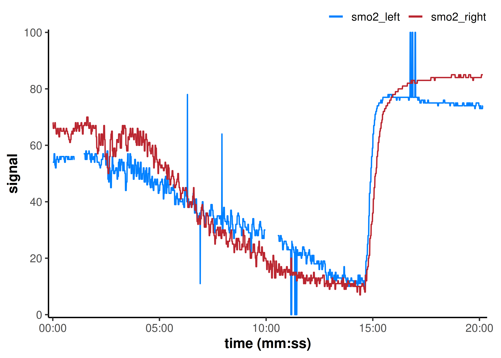
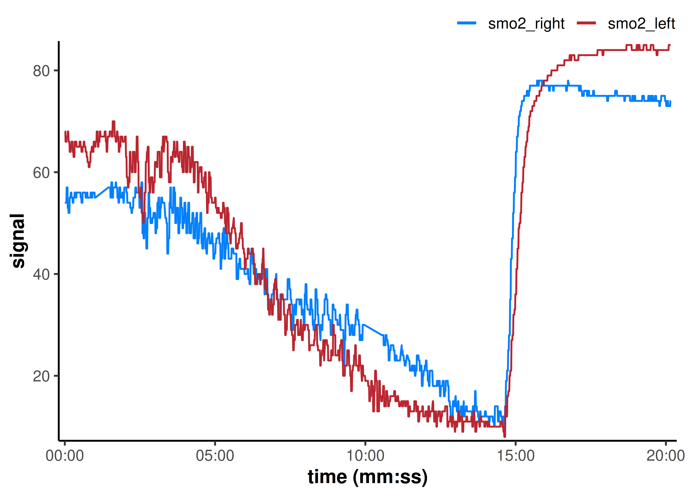
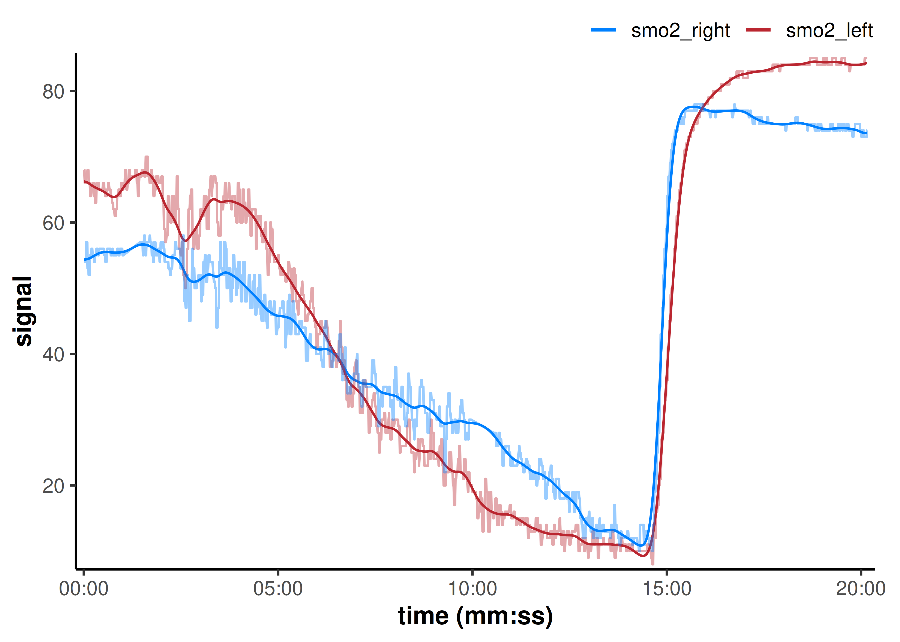
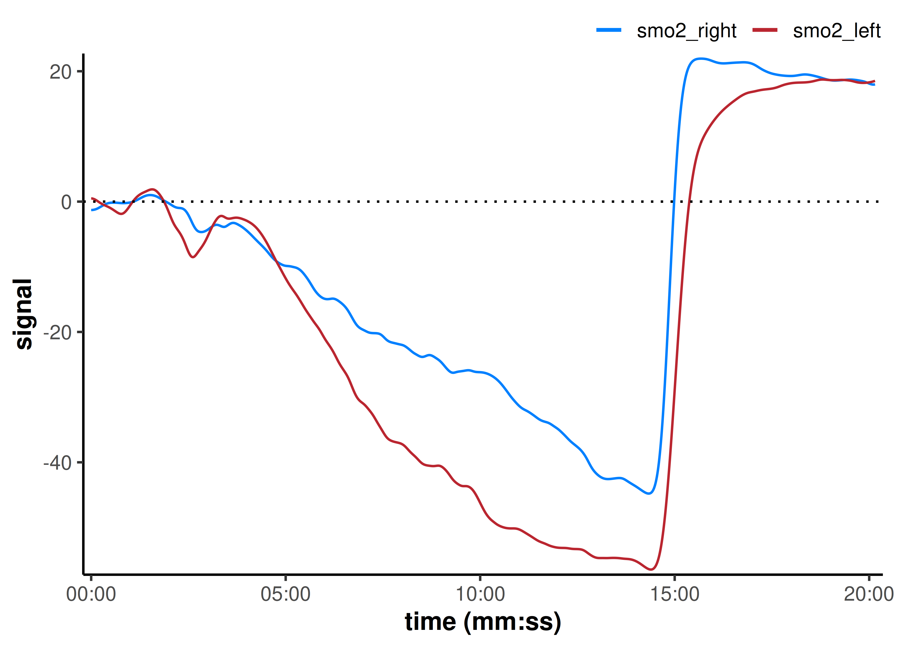
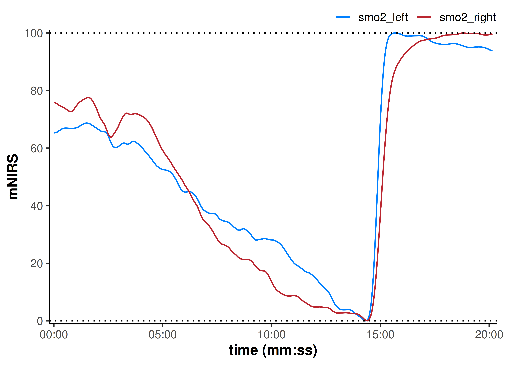
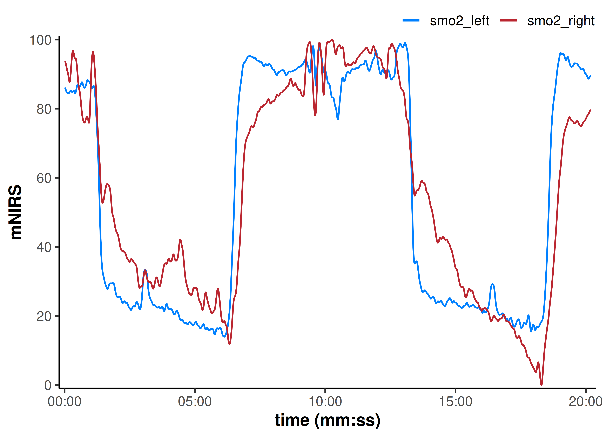
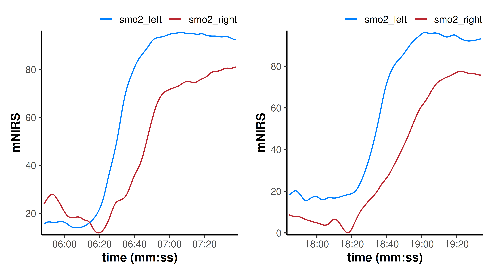
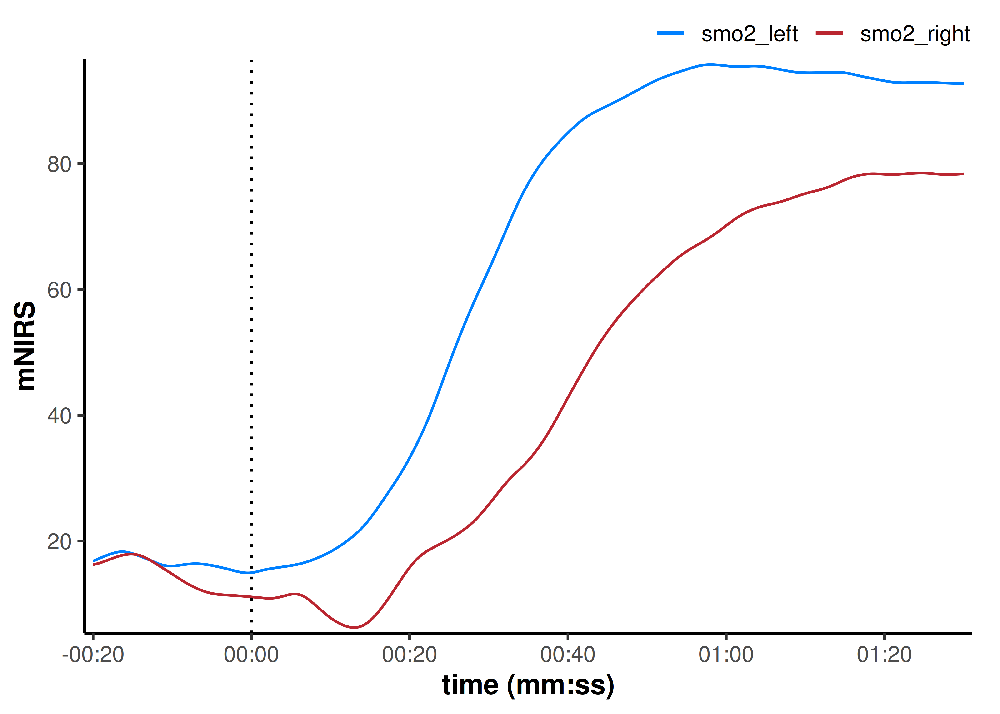

# Reading and Cleaning Data with {mnirs}

## Introduction

With modern wearable **muscle near-infrared spectroscopy (mNIRS)**
devices it is growing ever easier to collect local muscle oxygenation
data during dynamic activities.

The real challenge comes with deciding how to clean, filter, process,
and eventually interpret those data.

The [mnirs](https://jemarnold.github.io/mnirs/) package aims to provide
standardised, reproducible methods for reading, processing, and
analysing mNIRS data. The goal is to help practitioners detect
meaningful signal from noise, and improve our confidence in interpreting
and applying information to the clients we work with.

In this vignette we will demonstrate how to:

- 📂 Read data files exported from commercially available wearable NIRS
  devices, and import NIRS channels into a standard data frame format
  with metadata, ready for further processing.

- 📊 Plot and visualise data frames of class *`"mnirs"`*.

- 🔍 Retrieve metadata stored with data frames of class *`"mnirs"`* to
  avoid repetitively specifying which channels to process.

- 🧹 Detect and replace local outliers, invalid values, and interpolate
  across missing data.

- ⏱️ Resample data to a higher or lower sample rate, to correct
  irregular sampling periods or match the frequency of other data
  sources.

- 📈️ Apply digital filtering to optimise signal-to-noise ratio for the
  responses observed in our data.

- ⚖️ Shift and rescale across multiple NIRS channels, to normalise
  signal dynamic range while preserving absolute or relative scaling
  between muscle sites and NIRS channels.

- 🔀 Demonstrate a complete data wrangling process using pipe-friendly
  functions.

- 🧮 Detect and extract intervals for further analysis.

*`mnirs`* is currently [](https://lifecycle.r-lib.org/articles/stages.html#experimental).
Functionality may change! Stay updated on development and follow
releases at
[github.com/jemarnold/mnirs](https://github.com/jemarnold/mnirs).

*`mnirs`* is designed to process NIRS data, but it can be used to read,
clean, and process other time series data which require many of the same
processing steps. Enjoy!

## 📂 Read data from file

We will read an example data file with two NIRS channels from an
incremental ramp cycling assessment recorded with *Moxy* muscle oxygen
monitor.

First, install and load the *`mnirs`* package and other required
libraries.

*`mnirs`* can be installed with `install.packages("mnirs")`.

``` r
# pak::pak("jemarnold/mnirs") ## install development version
library(ggplot2) ## load for plotting
library(mnirs)
```

The first function called will often be
[`read_mnirs()`](https://jemarnold.github.io/mnirs/reference/read_mnirs.md).
This is used to read data from *.csv* or *.xls(x)* files exported from
common wearable NIRS devices.

Exported data files will often have multiple rows of file header
metadata before the data table with NIRS recordings begins. `read_mnirs`
can extract and return this data table along with the file metadata for
further processing and analysis.

See
[`read_mnirs()`](https://jemarnold.github.io/mnirs/reference/read_mnirs.md)
for more details.

### `read_mnirs()`

- `file_path`

  Specify the location of the data file, including file extension.
  e.g. `"./my_file.xlsx"` or `"C:/myfolder/my_file.csv"`.

> **Example data files**
>
> A few example data files are included in the *`mnirs`* package. File
> paths can be accessed with
> [`example_mnirs()`](https://jemarnold.github.io/mnirs/reference/example_mnirs.md)

- `nirs_channels`

  Multiple *NIRS* channels can be specified from the data file as a
  vector of names. If no `nirs_channels` are specified,
  [`read_mnirs()`](https://jemarnold.github.io/mnirs/reference/read_mnirs.md)
  will attempt to recognise the NIRS device file format, and return the
  full data frame with all detected columns. This can be useful for file
  exploration, to find the target channel names. However, best practice
  is to specify the desired `nirs_channels` explicitly

- `time_channel`

  A *time* or *sample* channel name from the data table can be
  specified. If left blank, the function will attempt to identify the
  time column automatically, however, best practice is to specify the
  `time_channel` explicitly.

- `event_channel`

  Optionally, A channel can be specified which indicates character
  *event* labels or integer *lap* values in the data table.  
    
  These channel names are used to detect the data table within the file,
  and must match exactly with text strings in the file on the same row.
  We can rename these channels when reading data by specifying a named
  character vector:

``` r
nirs_channels = c(renamed1 = "original_name1", 
                  renamed2 = "original_name2")
```

- `sample_rate`

  The sample rate (in Hz) of the exported data can either be specified
  explicitly, or it will be estimated from `time_channel`.  
    
  Automatic detection usually works well unless there is irregular
  sampling, or the `time_channel` is a count of samples rather than a
  time value. For example, *Oxysoft* exports a column of sample numbers
  rather than time values. For *Ozysoft* files specifically, the
  function will recognise and read the correct sample rate from the file
  metadata. However, in most cases `sample_rate` should be defined
  explicitly if known.

- `add_timestamp`

  `FALSE` by default; if `time_channel` is in date-time (POSIXct) format
  (e.g.; *hh:mm:ss*), by default it will be converted to numeric time in
  seconds.  
    
  If `add_timestamp = TRUE`, the date-time start time value in
  `time_channel` or in the file metadata will be extracted and a
  `"timestamp"` column will be added to the returned data frame. This
  can be useful for synchronising devices based on system time.

- `zero_time`

  `FALSE` by default; if `time_channel` values start at a non-zero
  value, `zero_time = TRUE` will re-calculate time starting from zero.
  If `time_channel` was converted from date-time format, it will always
  be re-calculated from zero regardless of this option.

- `keep_all`

  `FALSE` by default; only the channels explicitly specified will be
  returned in a data frame. `keep_all = TRUE` will return all columns
  detected from the data table in the file.  
    
  Blank/empty columns will be omitted. Duplicate column names will be
  repaired by appending a suffix `"_n"`, and empty column names will be
  renamed as `col_n`; where `n` is equal to the column number in the
  data file. Renamed columns should be checked to confirm correct naming
  if duplicates are present.

- `verbose`

  `TRUE` by default; this and most *`mnirs`* functions will return
  warnings and informational messages which are useful for
  troubleshooting and data validation. This option can be used to
  silence those messages. *`mnirs`* messages can be silenced globally
  for a session by setting `options(mnirs.verbose = FALSE)`.

``` r
## {mnirs} includes sample files from a few NIRS devices
example_mnirs()
#> [1] "artinis_intervals.xlsx"  "moxy_intervals.csv"     
#> [3] "moxy_ramp.xlsx"          "portamon-oxcap.xlsx"    
#> [5] "train.red_intervals.csv"

## partial matching will error if matches multiple
try(example_mnirs("moxy"))
#> Error in example_mnirs("moxy") : ✖ Multiple files match "moxy":
#> ℹ Matching files: "moxy_intervals.csv" and "moxy_ramp.xlsx"

data_raw <- read_mnirs(
    file_path = example_mnirs("moxy_ramp"), ## call an example data file
    nirs_channels = c(
        smo2_left = "SmO2 Live",            ## identify and rename channels
        smo2_right = "SmO2 Live(2)"
    ),
    time_channel = c(time = "hh:mm:ss"),    ## date-time format will be converted to numeric
    event_channel = NULL,                   ## leave blank if unused
    sample_rate = NULL,                     ## if blank, will be estimated from time_channel
    add_timestamp = FALSE,                  ## omit a date-time timestamp column
    zero_time = TRUE,                       ## recalculate time values from zero
    keep_all = FALSE,                       ## return only the specified data channels
    verbose = TRUE                          ## show warnings & messages
)
#> ! Estimated `sample_rate` = 2 Hz.
#> ℹ Define `sample_rate` explicitly to override.
#> Warning: ! Duplicate or irregular `time_channel` samples detected.
#> ℹ Investigate at `time` = 211.99 and 1184.
#> ℹ Re-sample with `mnirs::resample_mnirs()`.

## Note the above info message that sample_rate was estimated correctly at 2 Hz ☝
## ignore the warnings about irregular sampling for now, we will resample later

data_raw
#> # A tibble: 2,203 × 3
#>     time smo2_left smo2_right
#>    <dbl>     <dbl>      <dbl>
#>  1 0            54         68
#>  2 0.400        54         68
#>  3 0.960        54         68
#>  4 1.51         54         66
#>  5 2.06         54         66
#>  6 2.61         54         66
#>  7 3.16         54         66
#>  8 3.71         57         67
#>  9 4.26         57         67
#> 10 4.81         57         67
#> # ℹ 2,193 more rows
```

## 📊 Plot *`mnirs`* data

*`mnirs`* data can be easily viewed by calling
[`plot()`](https://rdrr.io/r/graphics/plot.default.html). This generic
plot function uses [ggplot2](https://ggplot2.tidyverse.org) and will
work on data frames generated or read by *`mnirs`* functions where the
metadata contain `class = *"mnirs"*`.

### `plot.mnirs`

- `data`

  This function takes in a data frame of class *`mnirs`* and returns a
  formatted [ggplot2](https://ggplot2.tidyverse.org) plot.

- `time_labels`

  `FALSE` by default; time values on the x-axis will be plotted as
  numeric by default. `time_labels = TRUE` will instead plot time values
  as `h:mm:ss` format.

- `n.breaks`

  Defines the number of breaks plotted on the x-axis, passed to the
  [ggplot2](https://ggplot2.tidyverse.org) settings.

- `na.omit`

  `FALSE` by default; missing data (`NA`s) will be plotted as gaps in
  the time-series data. If `na.omit = TRUE`, `NA`s will be omitted from
  the plotted data, effectively plotting across these gaps, making them
  less visible, but making the general data trend easier to see if there
  are lots of missing values.

``` r
## note the `time_labels` plot argument to display time values as `h:mm:ss`
plot(
    data_raw,
    time_labels = TRUE,
    n.breaks = 5,
    na.omit = FALSE
)
```



*`mnirs`* includes a custom `*ggplot2*` theme and colour palette
available with
[`theme_mnirs()`](https://jemarnold.github.io/mnirs/reference/theme_mnirs.md)
and
[`palette_mnirs()`](https://jemarnold.github.io/mnirs/reference/palette_mnirs.md).
See those documentation references for more details.

## 🔍 Metadata stored in *`mnirs`* data frames

Data frames generated or read by *`mnirs`* functions will return
`class = *"mnirs"*` and contain metadata, which can be retrieved with
`attributes(data)`.

Instead of re-defining values like our channel names or sample rate,
certain *`mnirs`* functions can automatically retrieve them from
metadata. They can always be overwritten manually in subsequent
functions, or by using a helper function
[`create_mnirs_data()`](https://jemarnold.github.io/mnirs/reference/create_mnirs_data.md).

See
[`create_mnirs_data()`](https://jemarnold.github.io/mnirs/reference/create_mnirs_data.md)
for more details about metadata.

``` r
## view metadata (omitting item two, a list of row numbers)
attributes(data_raw)[-2]
#> $row.names
#>    [1]    1    2    3    4    5    6    7    8    9   10   11   12   13   14
#>   [15]   15   16   17   18   19   20   21   22   23   24   25   26   27   28
#>   [29]   29   30   31   32   33   34   35   36   37   38   39   40   41   42
#>   [43]   43   44   45   46   47   48   49   50   51   52   53   54   55   56
#>   [57]   57   58   59   60   61   62   63   64   65   66   67   68   69   70
#>   [71]   71   72   73   74   75   76   77   78   79   80   81   82   83   84
#>   [85]   85   86   87   88   89   90   91   92   93   94   95   96   97   98
#>   [99]   99  100  101  102  103  104  105  106  107  108  109  110  111  112
#>  [113]  113  114  115  116  117  118  119  120  121  122  123  124  125  126
#>  [127]  127  128  129  130  131  132  133  134  135  136  137  138  139  140
#>  [141]  141  142  143  144  145  146  147  148  149  150  151  152  153  154
#>  [155]  155  156  157  158  159  160  161  162  163  164  165  166  167  168
#>  [169]  169  170  171  172  173  174  175  176  177  178  179  180  181  182
#>  [183]  183  184  185  186  187  188  189  190  191  192  193  194  195  196
#>  [197]  197  198  199  200  201  202  203  204  205  206  207  208  209  210
#>  [211]  211  212  213  214  215  216  217  218  219  220  221  222  223  224
#>  [225]  225  226  227  228  229  230  231  232  233  234  235  236  237  238
#>  [239]  239  240  241  242  243  244  245  246  247  248  249  250  251  252
#>  [253]  253  254  255  256  257  258  259  260  261  262  263  264  265  266
#>  [267]  267  268  269  270  271  272  273  274  275  276  277  278  279  280
#>  [281]  281  282  283  284  285  286  287  288  289  290  291  292  293  294
#>  [295]  295  296  297  298  299  300  301  302  303  304  305  306  307  308
#>  [309]  309  310  311  312  313  314  315  316  317  318  319  320  321  322
#>  [323]  323  324  325  326  327  328  329  330  331  332  333  334  335  336
#>  [337]  337  338  339  340  341  342  343  344  345  346  347  348  349  350
#>  [351]  351  352  353  354  355  356  357  358  359  360  361  362  363  364
#>  [365]  365  366  367  368  369  370  371  372  373  374  375  376  377  378
#>  [379]  379  380  381  382  383  384  385  386  387  388  389  390  391  392
#>  [393]  393  394  395  396  397  398  399  400  401  402  403  404  405  406
#>  [407]  407  408  409  410  411  412  413  414  415  416  417  418  419  420
#>  [421]  421  422  423  424  425  426  427  428  429  430  431  432  433  434
#>  [435]  435  436  437  438  439  440  441  442  443  444  445  446  447  448
#>  [449]  449  450  451  452  453  454  455  456  457  458  459  460  461  462
#>  [463]  463  464  465  466  467  468  469  470  471  472  473  474  475  476
#>  [477]  477  478  479  480  481  482  483  484  485  486  487  488  489  490
#>  [491]  491  492  493  494  495  496  497  498  499  500  501  502  503  504
#>  [505]  505  506  507  508  509  510  511  512  513  514  515  516  517  518
#>  [519]  519  520  521  522  523  524  525  526  527  528  529  530  531  532
#>  [533]  533  534  535  536  537  538  539  540  541  542  543  544  545  546
#>  [547]  547  548  549  550  551  552  553  554  555  556  557  558  559  560
#>  [561]  561  562  563  564  565  566  567  568  569  570  571  572  573  574
#>  [575]  575  576  577  578  579  580  581  582  583  584  585  586  587  588
#>  [589]  589  590  591  592  593  594  595  596  597  598  599  600  601  602
#>  [603]  603  604  605  606  607  608  609  610  611  612  613  614  615  616
#>  [617]  617  618  619  620  621  622  623  624  625  626  627  628  629  630
#>  [631]  631  632  633  634  635  636  637  638  639  640  641  642  643  644
#>  [645]  645  646  647  648  649  650  651  652  653  654  655  656  657  658
#>  [659]  659  660  661  662  663  664  665  666  667  668  669  670  671  672
#>  [673]  673  674  675  676  677  678  679  680  681  682  683  684  685  686
#>  [687]  687  688  689  690  691  692  693  694  695  696  697  698  699  700
#>  [701]  701  702  703  704  705  706  707  708  709  710  711  712  713  714
#>  [715]  715  716  717  718  719  720  721  722  723  724  725  726  727  728
#>  [729]  729  730  731  732  733  734  735  736  737  738  739  740  741  742
#>  [743]  743  744  745  746  747  748  749  750  751  752  753  754  755  756
#>  [757]  757  758  759  760  761  762  763  764  765  766  767  768  769  770
#>  [771]  771  772  773  774  775  776  777  778  779  780  781  782  783  784
#>  [785]  785  786  787  788  789  790  791  792  793  794  795  796  797  798
#>  [799]  799  800  801  802  803  804  805  806  807  808  809  810  811  812
#>  [813]  813  814  815  816  817  818  819  820  821  822  823  824  825  826
#>  [827]  827  828  829  830  831  832  833  834  835  836  837  838  839  840
#>  [841]  841  842  843  844  845  846  847  848  849  850  851  852  853  854
#>  [855]  855  856  857  858  859  860  861  862  863  864  865  866  867  868
#>  [869]  869  870  871  872  873  874  875  876  877  878  879  880  881  882
#>  [883]  883  884  885  886  887  888  889  890  891  892  893  894  895  896
#>  [897]  897  898  899  900  901  902  903  904  905  906  907  908  909  910
#>  [911]  911  912  913  914  915  916  917  918  919  920  921  922  923  924
#>  [925]  925  926  927  928  929  930  931  932  933  934  935  936  937  938
#>  [939]  939  940  941  942  943  944  945  946  947  948  949  950  951  952
#>  [953]  953  954  955  956  957  958  959  960  961  962  963  964  965  966
#>  [967]  967  968  969  970  971  972  973  974  975  976  977  978  979  980
#>  [981]  981  982  983  984  985  986  987  988  989  990  991  992  993  994
#>  [995]  995  996  997  998  999 1000 1001 1002 1003 1004 1005 1006 1007 1008
#> [1009] 1009 1010 1011 1012 1013 1014 1015 1016 1017 1018 1019 1020 1021 1022
#> [1023] 1023 1024 1025 1026 1027 1028 1029 1030 1031 1032 1033 1034 1035 1036
#> [1037] 1037 1038 1039 1040 1041 1042 1043 1044 1045 1046 1047 1048 1049 1050
#> [1051] 1051 1052 1053 1054 1055 1056 1057 1058 1059 1060 1061 1062 1063 1064
#> [1065] 1065 1066 1067 1068 1069 1070 1071 1072 1073 1074 1075 1076 1077 1078
#> [1079] 1079 1080 1081 1082 1083 1084 1085 1086 1087 1088 1089 1090 1091 1092
#> [1093] 1093 1094 1095 1096 1097 1098 1099 1100 1101 1102 1103 1104 1105 1106
#> [1107] 1107 1108 1109 1110 1111 1112 1113 1114 1115 1116 1117 1118 1119 1120
#> [1121] 1121 1122 1123 1124 1125 1126 1127 1128 1129 1130 1131 1132 1133 1134
#> [1135] 1135 1136 1137 1138 1139 1140 1141 1142 1143 1144 1145 1146 1147 1148
#> [1149] 1149 1150 1151 1152 1153 1154 1155 1156 1157 1158 1159 1160 1161 1162
#> [1163] 1163 1164 1165 1166 1167 1168 1169 1170 1171 1172 1173 1174 1175 1176
#> [1177] 1177 1178 1179 1180 1181 1182 1183 1184 1185 1186 1187 1188 1189 1190
#> [1191] 1191 1192 1193 1194 1195 1196 1197 1198 1199 1200 1201 1202 1203 1204
#> [1205] 1205 1206 1207 1208 1209 1210 1211 1212 1213 1214 1215 1216 1217 1218
#> [1219] 1219 1220 1221 1222 1223 1224 1225 1226 1227 1228 1229 1230 1231 1232
#> [1233] 1233 1234 1235 1236 1237 1238 1239 1240 1241 1242 1243 1244 1245 1246
#> [1247] 1247 1248 1249 1250 1251 1252 1253 1254 1255 1256 1257 1258 1259 1260
#> [1261] 1261 1262 1263 1264 1265 1266 1267 1268 1269 1270 1271 1272 1273 1274
#> [1275] 1275 1276 1277 1278 1279 1280 1281 1282 1283 1284 1285 1286 1287 1288
#> [1289] 1289 1290 1291 1292 1293 1294 1295 1296 1297 1298 1299 1300 1301 1302
#> [1303] 1303 1304 1305 1306 1307 1308 1309 1310 1311 1312 1313 1314 1315 1316
#> [1317] 1317 1318 1319 1320 1321 1322 1323 1324 1325 1326 1327 1328 1329 1330
#> [1331] 1331 1332 1333 1334 1335 1336 1337 1338 1339 1340 1341 1342 1343 1344
#> [1345] 1345 1346 1347 1348 1349 1350 1351 1352 1353 1354 1355 1356 1357 1358
#> [1359] 1359 1360 1361 1362 1363 1364 1365 1366 1367 1368 1369 1370 1371 1372
#> [1373] 1373 1374 1375 1376 1377 1378 1379 1380 1381 1382 1383 1384 1385 1386
#> [1387] 1387 1388 1389 1390 1391 1392 1393 1394 1395 1396 1397 1398 1399 1400
#> [1401] 1401 1402 1403 1404 1405 1406 1407 1408 1409 1410 1411 1412 1413 1414
#> [1415] 1415 1416 1417 1418 1419 1420 1421 1422 1423 1424 1425 1426 1427 1428
#> [1429] 1429 1430 1431 1432 1433 1434 1435 1436 1437 1438 1439 1440 1441 1442
#> [1443] 1443 1444 1445 1446 1447 1448 1449 1450 1451 1452 1453 1454 1455 1456
#> [1457] 1457 1458 1459 1460 1461 1462 1463 1464 1465 1466 1467 1468 1469 1470
#> [1471] 1471 1472 1473 1474 1475 1476 1477 1478 1479 1480 1481 1482 1483 1484
#> [1485] 1485 1486 1487 1488 1489 1490 1491 1492 1493 1494 1495 1496 1497 1498
#> [1499] 1499 1500 1501 1502 1503 1504 1505 1506 1507 1508 1509 1510 1511 1512
#> [1513] 1513 1514 1515 1516 1517 1518 1519 1520 1521 1522 1523 1524 1525 1526
#> [1527] 1527 1528 1529 1530 1531 1532 1533 1534 1535 1536 1537 1538 1539 1540
#> [1541] 1541 1542 1543 1544 1545 1546 1547 1548 1549 1550 1551 1552 1553 1554
#> [1555] 1555 1556 1557 1558 1559 1560 1561 1562 1563 1564 1565 1566 1567 1568
#> [1569] 1569 1570 1571 1572 1573 1574 1575 1576 1577 1578 1579 1580 1581 1582
#> [1583] 1583 1584 1585 1586 1587 1588 1589 1590 1591 1592 1593 1594 1595 1596
#> [1597] 1597 1598 1599 1600 1601 1602 1603 1604 1605 1606 1607 1608 1609 1610
#> [1611] 1611 1612 1613 1614 1615 1616 1617 1618 1619 1620 1621 1622 1623 1624
#> [1625] 1625 1626 1627 1628 1629 1630 1631 1632 1633 1634 1635 1636 1637 1638
#> [1639] 1639 1640 1641 1642 1643 1644 1645 1646 1647 1648 1649 1650 1651 1652
#> [1653] 1653 1654 1655 1656 1657 1658 1659 1660 1661 1662 1663 1664 1665 1666
#> [1667] 1667 1668 1669 1670 1671 1672 1673 1674 1675 1676 1677 1678 1679 1680
#> [1681] 1681 1682 1683 1684 1685 1686 1687 1688 1689 1690 1691 1692 1693 1694
#> [1695] 1695 1696 1697 1698 1699 1700 1701 1702 1703 1704 1705 1706 1707 1708
#> [1709] 1709 1710 1711 1712 1713 1714 1715 1716 1717 1718 1719 1720 1721 1722
#> [1723] 1723 1724 1725 1726 1727 1728 1729 1730 1731 1732 1733 1734 1735 1736
#> [1737] 1737 1738 1739 1740 1741 1742 1743 1744 1745 1746 1747 1748 1749 1750
#> [1751] 1751 1752 1753 1754 1755 1756 1757 1758 1759 1760 1761 1762 1763 1764
#> [1765] 1765 1766 1767 1768 1769 1770 1771 1772 1773 1774 1775 1776 1777 1778
#> [1779] 1779 1780 1781 1782 1783 1784 1785 1786 1787 1788 1789 1790 1791 1792
#> [1793] 1793 1794 1795 1796 1797 1798 1799 1800 1801 1802 1803 1804 1805 1806
#> [1807] 1807 1808 1809 1810 1811 1812 1813 1814 1815 1816 1817 1818 1819 1820
#> [1821] 1821 1822 1823 1824 1825 1826 1827 1828 1829 1830 1831 1832 1833 1834
#> [1835] 1835 1836 1837 1838 1839 1840 1841 1842 1843 1844 1845 1846 1847 1848
#> [1849] 1849 1850 1851 1852 1853 1854 1855 1856 1857 1858 1859 1860 1861 1862
#> [1863] 1863 1864 1865 1866 1867 1868 1869 1870 1871 1872 1873 1874 1875 1876
#> [1877] 1877 1878 1879 1880 1881 1882 1883 1884 1885 1886 1887 1888 1889 1890
#> [1891] 1891 1892 1893 1894 1895 1896 1897 1898 1899 1900 1901 1902 1903 1904
#> [1905] 1905 1906 1907 1908 1909 1910 1911 1912 1913 1914 1915 1916 1917 1918
#> [1919] 1919 1920 1921 1922 1923 1924 1925 1926 1927 1928 1929 1930 1931 1932
#> [1933] 1933 1934 1935 1936 1937 1938 1939 1940 1941 1942 1943 1944 1945 1946
#> [1947] 1947 1948 1949 1950 1951 1952 1953 1954 1955 1956 1957 1958 1959 1960
#> [1961] 1961 1962 1963 1964 1965 1966 1967 1968 1969 1970 1971 1972 1973 1974
#> [1975] 1975 1976 1977 1978 1979 1980 1981 1982 1983 1984 1985 1986 1987 1988
#> [1989] 1989 1990 1991 1992 1993 1994 1995 1996 1997 1998 1999 2000 2001 2002
#> [2003] 2003 2004 2005 2006 2007 2008 2009 2010 2011 2012 2013 2014 2015 2016
#> [2017] 2017 2018 2019 2020 2021 2022 2023 2024 2025 2026 2027 2028 2029 2030
#> [2031] 2031 2032 2033 2034 2035 2036 2037 2038 2039 2040 2041 2042 2043 2044
#> [2045] 2045 2046 2047 2048 2049 2050 2051 2052 2053 2054 2055 2056 2057 2058
#> [2059] 2059 2060 2061 2062 2063 2064 2065 2066 2067 2068 2069 2070 2071 2072
#> [2073] 2073 2074 2075 2076 2077 2078 2079 2080 2081 2082 2083 2084 2085 2086
#> [2087] 2087 2088 2089 2090 2091 2092 2093 2094 2095 2096 2097 2098 2099 2100
#> [2101] 2101 2102 2103 2104 2105 2106 2107 2108 2109 2110 2111 2112 2113 2114
#> [2115] 2115 2116 2117 2118 2119 2120 2121 2122 2123 2124 2125 2126 2127 2128
#> [2129] 2129 2130 2131 2132 2133 2134 2135 2136 2137 2138 2139 2140 2141 2142
#> [2143] 2143 2144 2145 2146 2147 2148 2149 2150 2151 2152 2153 2154 2155 2156
#> [2157] 2157 2158 2159 2160 2161 2162 2163 2164 2165 2166 2167 2168 2169 2170
#> [2171] 2171 2172 2173 2174 2175 2176 2177 2178 2179 2180 2181 2182 2183 2184
#> [2185] 2185 2186 2187 2188 2189 2190 2191 2192 2193 2194 2195 2196 2197 2198
#> [2199] 2199 2200 2201 2202 2203
#> 
#> $nirs_channels
#> [1] "smo2_left"  "smo2_right"
#> 
#> $time_channel
#> [1] "time"
#> 
#> $sample_rate
#> [1] 2
#> 
#> $start_timestamp
#> [1] "2026-03-25 00:29:00 UTC"
#> 
#> $names
#> [1] "time"       "smo2_left"  "smo2_right"
#> 
#> $class
#> [1] "mnirs"      "tbl_df"     "tbl"        "data.frame"
```

## 🧹 Replace local outliers, invalid values, and missing values

We can see some data issues in the plot above, so let’s clean those with
a single wrangling function
[`replace_mnirs()`](https://jemarnold.github.io/mnirs/reference/replace_mnirs.md),
to prepare our data for digital filtering and smoothing.

*`mnirs`* tries to include basic functions which work on vector data,
and convenience wrappers which combine functionality and can be used on
multiple channels in a data frame at once.

Let’s explain the functionality of this data-wide function, and for more
details about the vector-specific functions see
[`replace_mnirs()`](https://jemarnold.github.io/mnirs/reference/replace_mnirs.md).

### `replace_mnirs()`

- `data`

  Data-wide functions take in a data frame, apply processing to all
  channels specified explicity or implicitly from *`mnirs`* metadata,
  then return the processed data frame. *`mnirs`* metadata will be
  passed to and from this function.  
    
  *`mnirs`* functions are also pipe-friendly for Base R 4.1+ (`|>`) or
  [magrittr](https://magrittr.tidyverse.org) (`%>%`) pipes to chain
  operations together (see below).

- `nirs_channels`

  Specify which column names in `data` will be processed, i.e. the
  response variables. If not specified, these channels will be retrieved
  from *`mnirs`* metadata. Channels in the data but not explicitly
  specified will be passed through unprocessed to the returned data
  frame.

- `time_channels`

  The time channel can be specified, i.e. the predictor variable, or
  retrieved from *`mnirs`* metadata.

- `invalid_values`, `invalid_above`, or `invalid_below`

  Specific invalid values can be replaced, e.g. if a NIRS device exports
  `0`, `100`, or some other fixed value when signal recording is in
  error. If spikes or drops are present in the data, these can be
  replaced by specifying values above or below which to consider
  invalid. If left as `NULL`, no values will be replaced.

- `outlier_cutoff`

  Local outliers can be detected using a cutoff calculated from the
  local median value. A default value of `3` is recommended and
  correspond’s to Pearson’s rule (i.e., ± 3 SD about the local median).
  If left as `NULL`, no outliers will be replaced.

- `width` or `span`

  Local outlier detection and median interpolation use a rolling local
  window specified by one of either `width` or `span`. `width` defines a
  number of samples centred around the local index being evaluated
  (`idx`), whereas `span` defines a range of time in units of
  `time_channel`.

- `method`

  Missing data (`NA`), invalid values, and local outliers specified
  above can be replaced via interpolation or fill methods; either
  `"linear"` interpolation (the default), fill with local `"median"`, or
  `"locf"` (*“last observation carried forward”*).  
    
  `NA`s can be passed through to the returned data frame with
  `method = "none"`. However, subsequent processing & analysis steps may
  return errors when `NA`s are present. Therefore, it is good practice
  to deal with missing data early during data processing.

- `verbose`

  As above, an option to toggle warnings and info messages.

``` r
data_cleaned <- replace_mnirs(
    data_raw,           ## blank channels will be retrieved from metadata
    invalid_values = 0, ## known invalid values in the data
    invalid_above = 90, ## remove data spikes above 90
    outlier_cutoff = 3, ## recommended default value
    width = 10,         ## window to detect and replace outliers/missing values
    method = "linear"   ## linear interpolation over `NA`s
)

plot(data_cleaned, time_labels = TRUE)
```



That cleaned up all the obvious data issues.

## ⏱️ Resample data

Say we have NIRS data recorded at 25 Hz, but we are only interested in
exercise responses over a time span of 5-minutes, and our other outcome
measure heart rate data are only recorded at 1 Hz anyway. It may be
easier and faster to work with our NIRS data down-sampled from 25 to 1
Hz.

Alternatively, if we have something like high-frequency EMG data, we may
want to up-sample our NIRS data to match samples for easier
synchronisation and analysis (*although, we should be cautious with
up-sampling as this can artificially inflate statistical confidence with
subsequent analysis or modelling methods*).

### `resample_mnirs()`

- `data`

  This function takes in a data frame, applies processing to all
  channels specified, then returns the processed data frame. *`mnirs`*
  metadata will be passed to and from this function.

- `time_channel` & `sample_rate`

  If the data contain *`mnirs`* metadata, these channels will be
  detected automatically. Or they can be specified explicitly.

- `resample_rate`

  Resampling is specified as the desired number of samples per second
  (Hz). The default `resample_rate` will resample back to the existing
  `sample_rate` of the data. This can be useful to accomodate for
  irregular sampling with unequal time values. Linear interpolation is
  used to resample `time_channel` to round values of the `sample_rate`.

``` r
data_resampled <- resample_mnirs(
    data_cleaned,      ## blank channels will be retrieved from metadata
    resample_rate = 2, ## blank by default will resample to `sample_rate`
    method = "linear"  ## linear interpolation across resampled indices
)
#> ℹ Output is resampled at 2 Hz.

## note the altered "time" values from the original data frame 👇
data_resampled
#> # A tibble: 2,419 × 3
#>     time smo2_left smo2_right
#>    <dbl>     <dbl>      <dbl>
#>  1   0        54         68  
#>  2   0.5      54         68  
#>  3   1        54         67.9
#>  4   1.5      54         66.0
#>  5   2        54         66  
#>  6   2.5      54         66  
#>  7   3        54         66  
#>  8   3.5      55.9       66.6
#>  9   4        57         67  
#> 10   4.5      57         67  
#> # ℹ 2,409 more rows
```

> **Use
> [`resample_mnirs()`](https://jemarnold.github.io/mnirs/reference/resample_mnirs.md)
> to smooth over irregular or skipped samples**
>
> If we see a warning from
> [`read_mnirs()`](https://jemarnold.github.io/mnirs/reference/read_mnirs.md)
> about duplicated or irregular samples like we saw above, we can use
> [`resample_mnirs()`](https://jemarnold.github.io/mnirs/reference/resample_mnirs.md)
> to restore `time_channel` to a regular sample rate and interpolate
> across skipped samples.
>
> Note: if we perform both of these steps in a piped function call, we
> will still see the warning appear about irregular sampling at the end
> of the pipe. This warning is returned by
> [`read_mnirs()`](https://jemarnold.github.io/mnirs/reference/read_mnirs.md).
> But viewing the data frame can confirm that
> [`resample_mnirs()`](https://jemarnold.github.io/mnirs/reference/resample_mnirs.md)
> has resolved the issue.

## 📈 Digital filtering

To improve the signal-to-noise ratio in our dataset without losing
information, we should apply digital filtering to smooth the data.

### Choosing a digital filter

There are a few digital filtering methods available in *`mnirs`*. Which
option is best for *you* will depend in large part on the sample rate of
your data and the frequency of the response signal/phenomena you are
interested in observing.

Choosing filter parameters is an important processing step to improve
signal-to-noise ratio and enhance our subsequent interpretations.
Over-filtering the data can introduce data artefacts which can
negatively influence signal analysis and interpretations, just as much
as trying to analyse overly-noisy raw data.

It is perfectly valid to choose a digital filter by iteratively testing
filter parameters until the signal or response of interest appears to be
visually optimised with minimal data artefacts, to your satisfaction.

We will discuss the process of choosing a digital filter more in depth
in another article coming soon.

### `filter_mnirs()`

- `data`

  This function takes in a data frame, applies processing to all
  channels specified, then returns the processed data frame. *`mnirs`*
  metadata will be passed to and from this function.

- `nirs_channels`, `time_channel`, & `sample_rate`

  If the data contain *`mnirs`* metadata, these channels will be
  detected automatically. Or they can be specified explicitly.

- `na.rm`

  This important argument is left as `FALSE` by default.
  [`filter_mnirs()`](https://jemarnold.github.io/mnirs/reference/filter_mnirs.md)
  will return an error if any missing data (`NA`) are detected in the
  response variables (`nirs_channels`). Setting `na.rm = TRUE` will
  ignore these `NA`s and pass them through to the returned data frame,
  but this must be opted into explicitly in this function and elsewhere.

#### Smoothing-spline

- `method = "smooth_spline"`

  The default non-parametric cubic smoothing spline is often a good
  first filtering option when exploring the data, and works well over
  longer time spans. For more rapid and repeated responses, a
  smoothing-spline may not work as well.

- `spar`

  The smoothing parameter of the cubic spline will be determined
  automatically by default, or can be specified explicitly. See
  [`stats::smooth.spline()`](https://rdrr.io/r/stats/smooth.spline.html)

#### Butterworth digital filter

- `method = "butterworth"`

  A Butterworth low-pass digital filter (specified by `type = "low"`) is
  probably the most common method used in mNIRS research (whether
  appropriately or not). For certain applications such as identifying a
  signal with a known frequency (e.g. cycling/running cadence or heart
  rate), a pass-band or a different filter type may be better suited.

- `order`

  The filter order number, specifying the number of passes the filter
  performs over the data. The default `order = 2` will often noticably
  improve the filter over a single pass, however higher orders above
  ~`4` can begin to introduce artefacts, particularly at sharp
  transition points.

- `W` or `fc`

  The cutoff frequency can be specified either as `W`; a fraction
  (between `[0, 1]`) of the [*Nyquist
  frequency*](https://www.youtube.com/watch?v=IZJQXlbm2dU), which is
  equal to half of the `sample_rate` of the data. Or as `fc`; the cutoff
  frequency in Hz, where this absolute frequency should still be between
  0 Hz and the Nyquist frequency.

- `type`

  The filter type is specified as either
  `c("low", "high", "stop", "pass")`.

For filtering vector data and more details about Butterworth filter
parameters, see
[`filter_butter()`](https://jemarnold.github.io/mnirs/reference/filter_butter.md).

#### Moving average

- `method = "moving_average"`

  The simplest smoothing method is a moving average filter applied over
  a specified number of samples or timespan. Commonly, this might be a
  5- or 15-second centred moving average.

- `width` or `span`

  Moving average filtering occurs within a rolling local window
  specified by one of either `width` or `span`. `width` defines a number
  of samples centred around the local index being evaluated (`idx`),
  whereas `span` defines a range of time in units of `time_channel`.

For filtering vector data and more details about the moving average
filter, see
[`filter_ma()`](https://jemarnold.github.io/mnirs/reference/filter_ma.md)

### Apply the filter

Let’s try a *Butterworth low-pass* filter, and we’ll specify some
empirically chosen filter parameters for these data. See
[`filter_mnirs()`](https://jemarnold.github.io/mnirs/reference/filter_mnirs.md)
for further details on each of these filtering methods and their
respective parameters.

``` r
data_filtered <- filter_mnirs(
    data_resampled,         ## blank channels will be retrieved from metadata
    method = "butterworth", ## Butterworth digital filter is a common choice
    order = 2,              ## filter order number
    W = 0.02,               ## filter fractional critical frequency `[0, 1]`
    type = "low",           ## specify a "low-pass" filter
    na.rm = TRUE            ## explicitly ignore NAs
)

## we will add the non-filtered data back to the plot to compare
plot(data_filtered, time_labels = TRUE) +
    geom_line(
        data = data_cleaned, 
        aes(y = smo2_left, colour = "smo2_left"), alpha = 0.4
    ) +
    geom_line(
        data = data_cleaned, 
        aes(y = smo2_right, colour = "smo2_right"), alpha = 0.4
    )
```



That did a nice job reducing the high-frequency noise in our data, while
preserving the sharp edges, such as the rapid reoxygenation after
maximal exercise.

## ⚖️ Shift and rescale data

NIRS values are not measured on an absolute scale (arguably not even
percent (%) saturation/SmO₂). Therefore, we may need to adjust or
calibrate our data to normalise NIRS signal values between muscle sites,
individuals, trials, etc. depending on our intended comparison.

For example, we may want to set our mean baseline value to zero for all
NIRS signals at the start of a recording. Or we may want to compare
signal kinetics (the rate of change or time course of a response) after
rescaling signal amplitudes to a common dynamic range.

These functions allow us to either shift NIRS values up or down while
preserving the dynamic range (the absolute amplitude from minimum to
maximum values) of our NIRS channels, or rescale the data to a new
dynamic range with larger or smaller amplitude.

We can group NIRS channels together to preserve the absolute and
relative scaling among certain channels, and modify that scaling between
other groups of channels.

### `shift_mnirs()`

- `data`

  This function takes in a data frame, applies processing to all
  channels specified, then returns the processed data frame. *`mnirs`*
  metadata will be passed to and from this function.

- `nirs_channels`

  Channels should be grouped by providing a list
  (e.g. `list(c(A, B), c(C))`) where each group will be shifted to a
  common scale, and separate scales between groups. The relative scaling
  between channels will be preserved within each group, but lost between
  groups.  
    
  `nirs_channels` should be specified explicitly to ensure the intended
  grouping structure is returned. The default *`mnirs`* metadata will
  group all NIRS channels together.

- `time_channel`

  If the data contain *`mnirs`* metadata, this channels will be detected
  automatically. Or it can be specified explicitly

- `to` or `by`

  The shift amplitude can be specified by either shifting signals `to` a
  new value, or shifting signals `by` a fixed amplitude, given in units
  of the NIRS signals.

- `width` or `span`

  Shifting can be performed on the mean value within a window specified
  by one of either `width` or `span`. `width` defines a number of
  samples centred around the local index being evaluated (`idx`),
  whereas `span` defines a range of time in units of `time_channel`.  
    
  e.g. `width = 1` will shift from the single minimum sample, whereas
  `span = 1` would shift from the minimum mean value of all samples
  within one second.

- `position`

  Specifies how we want to shift the data; either shifting the *“min”*,
  *“max”*, or *“first”* sample(s).

For this data set, we want to shift each NIRS channel so that the mean
of the 2-minute baseline is equal to zero, which would then give us a
change in deoxygenation from baseline during the incremental cycling
protocol.

> **[tidyverse](https://tidyverse.tidyverse.org)-style channel name
> specification**
>
> This is a good time to note that here and in most *`mnirs`* functions,
> data channels can be specified using
> [tidyverse](https://tidyverse.tidyverse.org)-style naming; Data frame
> column names can be specified either with quotes as a character string
> (`"smo2"`), or as a direct symbol (`smo2`).
>
> [tidyselect](https://tidyselect.r-lib.org) support functions such as
> `starts_with()`, `matches()` can also be used.

``` r
data_shifted <- shift_mnirs(
    data_filtered,     ## un-grouped nirs channels to shift separately 
    nirs_channels = list(smo2_left, smo2_right), 
    to = 0,            ## NIRS values will be shifted to zero
    span = 120,        ## shift the *first* 120 sec of data to zero
    position = "first"
)

plot(data_shifted, time_labels = TRUE) +
    geom_hline(yintercept = 0, linetype = "dotted")
```



Before shifting, the minimum (end of exercise) values for *smo2_left*
and *smo2_right* were similar, but the starting baseline values were
different.

Whereas when we shift both baseline values to zero, we can see that the
*smo2_left* signal has a smaller deoxygenation amplitude compared to the
*smo2_right* signal, and a (slightly) greater hyperaemic reoxygenation
peak.

We have to consider how our assumptions and processing decisions will
influence our interpretations; by shifting both starting values, we are
normalising for, and implicitly assuming that the baseline represents
the same starting condition for the tissues in both legs.

This may or may not be an appropriate assumption for your research
question; for example, this may be appropriate when we are more
interested in the relative change (delta) in each leg during an
intervention or exposure (often referred to as `"∇SmO2"`), but not if we
were interested in asymmetries that could influence SmO₂ at rest.

### `rescale_mnirs()`

We may also want to rescale our data to a new dynamic range, changing
the units to a new amplitude.

- `data`

  This function takes in a data frame, applies processing to all
  channels specified, then returns the processed data frame. *`mnirs`*
  metadata will be passed to and from this function.

- `nirs_channels`

  Channels should be grouped by providing a list
  (e.g. `list(c(A, B), c(C))`) where each group will be rescaled to a
  common range, and separate ranges between groups. The relative scaling
  between channels will be preserved within each group, but lost between
  groups.  
    
  `nirs_channels` should be specified explicitly to ensure the intended
  grouping structure is returned. The default *`mnirs`* metadata will
  group all NIRS channels together.

- `range`

  Specifies the new dynamic range in the form `c(min, max)`. For
  example, if we want to calibrate each NIRS signal to their own
  observed ‘functional range’ during exercise, we could rescale them to
  0-100%.

``` r
data_rescaled <- rescale_mnirs(
    data_filtered,    ## un-grouped nirs channels to rescale separately 
    nirs_channels = list(smo2_left, smo2_right), 
    range = c(0, 100) ## rescale to a 0-100% functional exercise range
)

plot(data_rescaled, time_labels = TRUE) +
    geom_hline(yintercept = c(0, 100), linetype = "dotted")
```



Here, our assumption is that during a maximal exercise task, the minimum
and maximum values represent the functional capacity of each tissue
volume being observed. So we rescale the functional dynamic range in
each leg.

By normalising this way, we might lose meaningful differences captured
by the different amplitudes between *smo2_left* and *smo2_right*, but we
might be more interested in the trend or time course of each response.

Our interpretation may be that *smo2_right* appears to start at a
slightly higher percent of its functional range, deoxygenates faster
toward a minimum, and reaches a quasi-plateau near maximal exercise.
While *smo2_left* deoxygenates slightly slower and continues to
deoxygenate until maximal task tolerance.

Additionally, the left leg reoxygenates slightly faster than right
during recovery. This might, for example, indicate exercise capacity
differences between the limbs (although these differences are marginal
and only discussed as representative for influence on interpretations).

## 🔀 Pipe-friendly functions

Most *`mnirs`* functions can be piped together using Base R 4.1+ (`|>`)
or [magrittr](https://magrittr.tidyverse.org) (`%>%`). The entire
pre-processing stage can easily be performed in a sequential pipe.

To demonstrate this, we’ll read a different example file recorded with
*Train.Red FYER* muscle oxygen sensor and pipe it through each
processing stage straight to a plot.

This is also a good time to demonstrate how to use the global
`mnirs.verbose` argument to silence all warning & information messages,
for example when dealing with a familiar dataset. We recommend leaving
`verbose = TRUE` by default whenever reading and exploring a new file.

``` r
options(mnirs.verbose = FALSE)

nirs_data <- read_mnirs(
    example_mnirs("train.red"),
    nirs_channels = c(
        smo2_left = "SmO2 unfiltered",
        smo2_right = "SmO2 unfiltered"
    ),
    time_channel = c(time = "Timestamp (seconds passed)"),
    zero_time = TRUE
) |>
    resample_mnirs() |> ## default settings will resample to the same `sample_rate`
    replace_mnirs(
        invalid_above = 73,
        outlier_cutoff = 3,
        span = 7
    ) |>
    filter_mnirs(
        method = "butterworth",
        order = 2,
        W = 0.02,
        na.rm = TRUE
    ) |>
    shift_mnirs(
        nirs_channels = list(smo2_left, smo2_right), ## 👈 channels grouped separately
        to = 0,
        span = 60,
        position = "first"
    ) |>
    rescale_mnirs(
        nirs_channels = list(c(smo2_left, smo2_right)), ## 👈 channels grouped together
        range = c(0, 100)
    )

plot(nirs_data, time_labels = TRUE)
```



We have two exercise intervals in this data set. Let’s demonstrate some
of the common analysis methods currently available with *`mnirs`*.

## 🧮 Interval extraction

After the NIRS signal has been cleaned and filtered, it should be ready
for further processing and analysis.

*`mnirs`* is under development to include functionality for processing
discrete intervals and events, e.g. reoxygenation kinetics, slope
calculations for post-occlusion microvascular responsiveness, and
critical oxygenation breakpoints.

### `extract_intervals()`

Often we will need to locate and extract smaller intervals from a NIRS
recording, for further processing and analysis. For example, if we want
to extract the last three minutes from repeated exercise trials.

We may have marked event labels or have incremental lap numbers in the
specified `event_channel`, or we may simply have to manually specify the
event markers by `time_channel` value or row number in the data frame.
See
[`extract_intervals()`](https://jemarnold.github.io/mnirs/reference/extract_intervals.md)
for more details.

- `data`

  This function takes in a data frame, applies processing to all
  channels specified, then returns a list of processed data frames.
  *`mnirs`* metadata will be passed to and from this function.

- `nirs_channels`

  If returning a list of *“distinct”* intervals (see `event_groups`
  below), `nirs_channels` does not have to be specified, as no channels
  are processed.  
    
  Only when *“ensemble”*-averaging, `nirs_channels` should be specified
  by providing a list of column names (e.g. `list(c(A, B), c(A))`),
  where each list item specifies the channels to be ensemble-averaged
  within the respective group (ensemble-groups are specified by
  `event_groups` below), in the order in which they are returned. The
  default *`mnirs`* metadata will ensemble-average all `nirs_channels`.

- `time_channel`, `event_channel`, & `sample_rate`

  If the data contain *`mnirs`* metadata, these channels will be
  detected automatically. Or they can be specified explicitly.

- `start` & `end`

  Interval boundaries are specified using helper functions:
  [`by_time()`](https://jemarnold.github.io/mnirs/reference/by_time.md)
  for `time_channel` values;
  [`by_sample()`](https://jemarnold.github.io/mnirs/reference/by_time.md)
  for sample indices (row numbers);
  [`by_label()`](https://jemarnold.github.io/mnirs/reference/by_time.md)
  for `event_channel` labels; or
  [`by_lap()`](https://jemarnold.github.io/mnirs/reference/by_time.md)
  for `event_channel` lap integers. Provide both `start` and `end` to
  define precise intervals, or provide `start` alone with `span` to
  extract windows around events. Multiple values can be passed to
  extract multiple intervals.

- `event_groups`

  Events can be extracted and returned as a list of `"distinct"`
  intervals, or `"ensemble"`-averaged into a single data frame. Custom
  grouping structure for ensemble-averaging can be specified by event
  number, in order of appearance within the original data.  
    
  e.g. `event_groups = list(c(1, 2), c(3, 4))` would return a list of
  two intervals, each ensemble-averaged from the respective events, in
  sequential order from the original data.

- `span`

  When only `start` (or `end`) is provided, `span` specifies a time
  window in units of `time_channel` as `c(before, after)`, where
  positive values indicate time after the event and negative values
  indicate time before. When both `start` and `end` are provided, `span`
  shifts boundaries additively: `span[1]` adjusts starts, `span[2]`
  adjusts ends.  
    
  A list of unique `span` vectors can be specified for each interval,
  otherwise a single `span` vector will be recycled to all intervals.

- `zero_time`

  `FALSE` by default; because `time_channel` values within each returned
  interval likely start at a non-zero value, `zero_time = TRUE` will
  re-calculate time starting from zero at the specified event. Meaning
  the start time (or however an event is specified) will become `0`.  
    
  When ensemble-averaging across intervals, time will always be
  re-calculated from `0`, since the time values have lost their meaning.

``` r
## return each interval independently with `event_groups = "distinct"`
distinct_list <- extract_intervals(
    nirs_data,                  ## channels blank for "distinct" grouping
    start = by_time(177, 904),  ## manually identified interval start times
    end = by_time(357, 1084),   ## interval end time (start + 180 sec)
    event_groups = "distinct",  ## return a list of data frames for each (2) event
    span = c(0, 0),             ## no modification to the 3-min intervals
    zero_time = FALSE           ## return original time values
)

## use `{patchwork}` package to plot intervals side by side
library(patchwork)

plot(distinct_list[[1L]]) + plot(distinct_list[[2L]])
```



``` r
## ensemble average both intervals with `event_groups = "ensemble"`
ensemble_list <- extract_intervals(
    nirs_data,                  ## channels recycled to all intervals by default
    nirs_channels = c(smo2_left, smo2_right),
    start = by_time(177, 904),  ## alternatively specify start times + 180 sec
    event_groups = "ensemble",  ## ensemble-average across two intervals
    span = c(0, 180),           ## span recycled to all intervals by default
    zero_time = TRUE            ## re-calculate common time to start from `0`
)

plot(ensemble_list[[1L]])
```



The ensemble-averaged kinetics capture a more representative ‘average’
response across the two exercise intervals. Note the transient spikes in
each interval are somewhat smoothed over.

Ensemble-averaging can help mitigate data dropouts and other quality
issues from measurement error or biological variability. For example,
ensemble-averaging is common for evaluating systemic VO₂ kinetics, where
responses can be highly variable trial to trial.

## Conclusion

This vignette walks through the core functionality of *`mnirs`* to read,
clean, and pre-process data in preparation for analysis.

Future development and articles will cover standardised analysis
methods, including deoxygenation & reoxygenation kinetics and critical
oxygenation breakpoint analysis.
