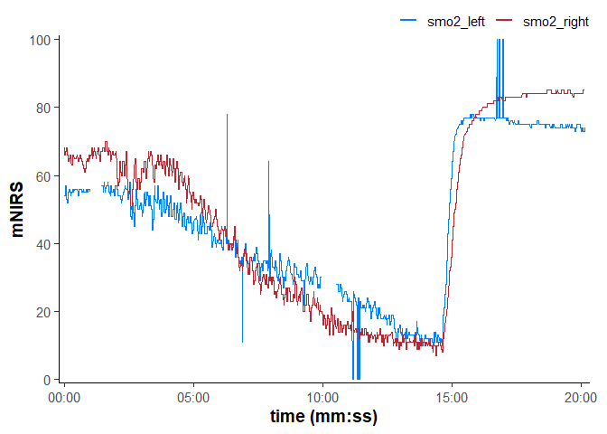
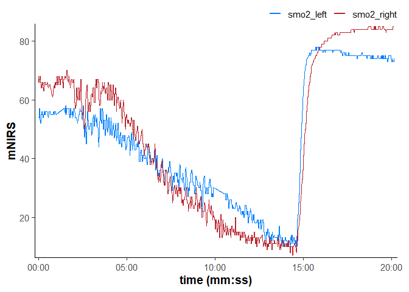
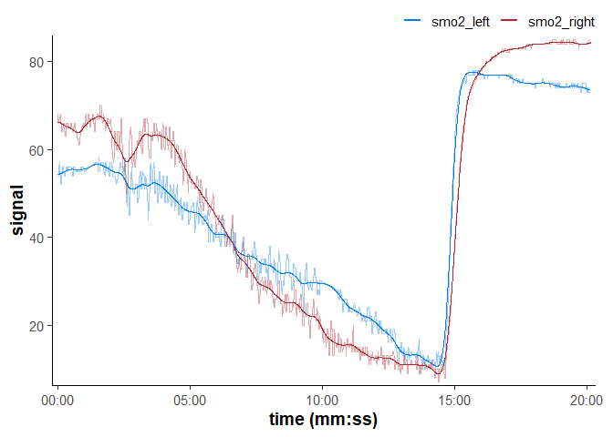
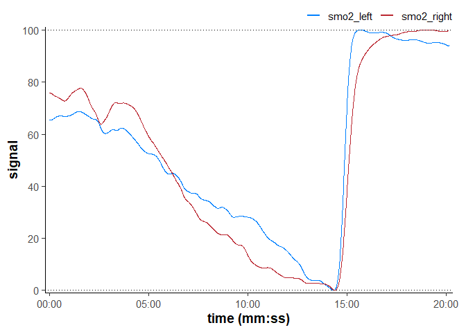
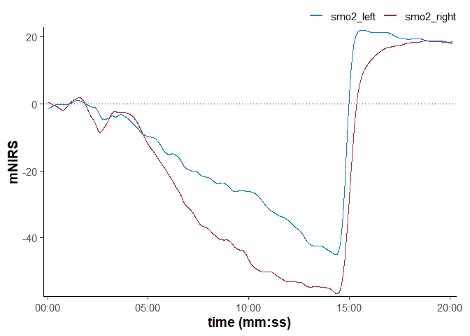
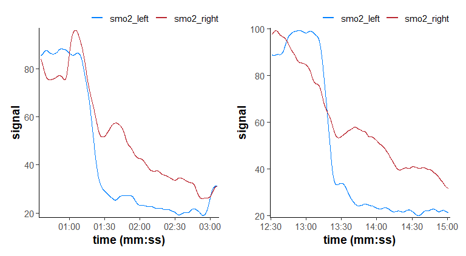
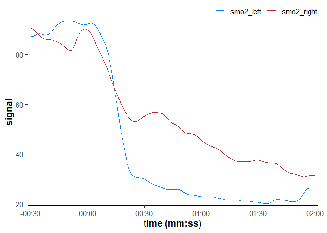

<!-- 
render with terminal cmd: 
quarto render vignettes/articles/mnirs-manuscript.qmd --output-dir "C:/OneDrive - UBC/PhD"
 -->


# Introduction

Near-infrared spectroscopy (NIRS) is a non-invasive optical technology used to evaluate the dynamic balance of local oxygen (O~2~) delivery and extraction in vivo within biological tissue. NIRS records the change in optical reflectance and absorbance as specific wavelengths of light pass through tissue between the sensor emitter and receiver (technical details and applications of NIRS can be found in {Barstow, 2019, 636} and {Grassi, 2016}). These signals are resolved as the relative change in oxygenation, or O~2~ saturated primarily on haemoglobin and myoglobin within the field of insonation (i.e., Hb, HbMb, or haeme; oxygenated oxy[haeme] or O~2~Hb; and deoxygenated deoxy[haeme] or HHb, respectively). Relative muscle or tissue oxygen saturation can be resolved as a percent (i.e., SmO~2~, or tissue saturation index; TSI).

NIRS has been used in human biology research for nearly half a century looking predominantly at cerebral (functional; fNIRS) and muscle (mNIRS) tissues {Jobsis, 1977}. In the past 15 years, the emergence of wearable continuous wave (CW) mNIRS devices has rapidly expanded use outside of advanced research laboratory environments. Wearable mNIRS devices have facilitated data collection in field conditions for diverse real-world applications in exercise physiology, sport science, clinical applications, and high performance sport {Grassi, 2016; Perrey, 2024; Jan, 2026}. Today, wearable mNIRS devices are relatively affordable, valid, reliable, and in widespread use across these domains {McManus, 2018, 56; Barstow, 2019, 636; Yogev, 2023, 6033}.

## Current Landscape and Gaps

While collecting NIRS data is easier than ever, processing, analysing, and interpreting those data remain a challenge. NIRS signals can be relatively noisy and notoriously sensitive to differences in tissue composition {van Beekvelt, 2001, 4237; McManus, 2018, 56; Stuer, 2024}. CW‑NIRS is limited to providing only relative measurements over an unknown denominator: scattering and absorption coefficients of tissue are assumed to be fixed, but in reality are variable and unknown {Hammer, 2019, 3380; Pirovano, 2021}. NIRS values are sensitive to initial tissue conditions, and are only interpretable as a relative change from initial calibration {Barstow, 2019, 636}.

During a single recording, the direction and rate of change of NIRS signals can be interpreted with confidence: Higher values indicate relatively greater concentrations and lower values indicate relatively lower concentrations. A decrease in oxygenation implies O~2~ extraction exceeds O~2~ delivery; an increase implies the reverse; and steeper response kinetics in either direction indicate a greater mismatch between these underlying metabolic rates {Barstow, 2019, 636; Arnold, 2024, 7851}.

However, comparing NIRS values between individuals, between recording sessions, or even between muscle sites simultaneously in the same individual can have lower reliability and agreement {Yogev, 2023, 6033; Sendra-Pérez, 2023, 6035; Skotzke, 2024}. Thus, cross-sectional research between individuals where tissue composition, optical properties, and initial metabolic conditions are unknown, requires more cautious interpretation.

As a result of these technological challenges and the wide variety of applications in which NIRS is used, it is difficult to provide standardised processing and analysis methods which will be universally appropriate. Each centre may be using NIRS for a unique application and must therefore also develop custom processing and analysis tools to suit their specific needs. Often, this takes the form of an ad hoc script or spreadsheet developed iteratively over time. Where previous processing decisions may be carried forward with inertia while the original rationale for them is lost, or the application for which they were intended has become obsolete. This mishmash of custom processing tools may be compromising cross-centre collaboration and reproducibility {Sendra-Perez, 2025, 8298}.

## Statement of Need

The open-source R package `mnirs` was developed to reduce barriers to cross-centre collaboration. The aim is to provide standardised, reproducible methods for reading, processing, and analysing mNIRS data accessible to researchers, practitioners, and NIRS users with minimal coding experience. Ultimately, the goal is to allow NIRS practitioners to focus on extracting meaningful signal from noise and improve our confidence when applying information to the clients we work with.

## Availability

`mnirs` is currently released as version 0.6.0 on the comprehensive R archive network (CRAN). The official CRAN release can be downloaded directly in the R working environment by calling:

`install.packages("mnirs")`

The latest development version can be downloaded from:

`pak::pak("jemarnold/mnirs")`

The package website has comprehensive documentation of the functions discussed below, and includes vignettes demonstrating common mNIRS data processing pipelines:

`https://jemarnold.github.io/mnirs/articles/reading-mnirs-data.html`

A free online app is available as a 'no-code' workflow with basic `mnirs` functionality, for rapid visualisation and comparison of processing methods:

`https://jemarnold-mnirs-app.share.connect.posit.cloud/`

## Processing Functionality

### Reading Data

The first step of processing is to retrieve data from a file exported from the NIRS device. Each NIRS device exports data in a different format, and files often have header metadata at the top of the file for human-readability. However, this makes it more difficult to extract the intended time-series data table into a standard data frame format.

`read_mnirs()`: This will typically be the first function called from `mnirs` in a new project. This is used to read data from *.csv* or *.xls(x)* files. It can automatically recognise most file formats exported from common wearable NIRS devices. Users can extract and rename the target NIRS channels (e.g. SmO~2~, O~2~Hb, etc.) for further processing. Users can specify the time or sample channel, or let it be detected automatically. An optional channel for event labels or lap integers can also be specified, which can be used to detect and extract intervals for further analysis (see below).

Metadata such as sample rate and recording start time will also be extracted and preserved along with the NIRS and time channels as metadata embedded in the returned data frame. This metadata is carried along with the data frame and is automatically recalled by subsequent `mnirs` functions. This reduces the need to repeatedly specify which channels should be processed at each step. Metadata can be manually modified and added to data frames not initially read with `read_mnirs()` by using `create_mnirs_data()`.

## Visualisation

A critical step of the data processing pipeline is visualising and plotting time series data to observe and understand the effects of each processing decision. mNIRS processing can be an iterative process, where decisions are made based on visual evaluation of signal optimisation and noise minimisation.

`plot.mnirs()`: A generic `plot()` function can be called on data which has been read and processed by `mnirs`, and which contains metadata for the NIRS and time channels (see Figure 1). These channels will be automatically plotted and can be modified using `ggplot2` syntax {Wickham, 2016}.

{fig-alt="Plot of example NIRS data included in `mnirs` package and read by `read_mnirs()`, with default generic `plot()` settings." width=\"90%\" fig-align="center"}

Figure 1: Plot of example NIRS data included in `mnirs` package and read by `read_mnirs()`, with default generic `plot()` settings.


## Data Cleaning

`replace_mnirs()`: This function is used to detect local outliers and specify either specific invalid values or a range outside of which values are considered invalid. This is useful where devices might return default invalid values - e.g. `0` or `100` %SmO~2~ - when they cannot determine the NIRS signal. Or where brief movement artefacts might cause the signal to spike well beyond the range of physiological data. Additionally, it can replace missing values via a number of interpolation methods.

Explicit local outlier detection is common in signal processing of physiological data, e.g. for expired gas exchange {Nolte, 2023}. Whereas it is less commonly used in NIRS research in favour of digital filtering (see below) {Dans, 2021; Rodriguez, 2018, 12}. However, data spikes can still be influential despite signal smoothing. Outlier detection may not be required for all datasets, but it is recommended before further filtering when large data spikes are present, such as the synthetic example in Figure 1.

{fig-alt="Data cleaned of invalid values, local outliers, and missing data filled via linear interpolation." width=\"90%\" fig-align="center"}

Figure 2: Data cleaned of invalid values, local outliers, and missing data filled via linear interpolation.

## Resampling

mNIRS devices may record at sample rates anywhere from less than 1 Hz to 100 Hz or higher. Higher sample rates gives greater precision to observe highly dynamic, rapid physiological responses. However, issues can arise with irregular sampling where time samples occur at inconsistent frequencies, are repeated, or are lost. Manually synchronising data channels by matching columns in a spreadsheet can lead to inaccurate time lag between signals. Even algorithmically synchronising signals between devices at these time scales can be challenging if sample times are off by fractions of a second, resulting in an apparent lack of matching timestamps between recordings. 

`resample_mnirs()`: This function can resample data to regularise timestamps to the nearest time value according to the known sample rate. This will improve synchronisation and can make subsequent processing steps easier, such as if ensemble-averaging across multiple trials (see below). In addition, this function can be used to up- or downsample NIRS data to match the sample rate of another device, e.g. to a 1 Hz heart rate signal, or a 1000 Hz electromyography (EMG) signal. 

Downsampling can be useful to reduce data size and processing requirement, although should not be used primarily as a data filtering/smoothing strategy (see below for digital filtering recommendations). Upsampling can be done with interpolation over newly created samples (caution should always be taken with sample interpolation), or new samples can be left blank.

## Digital Filtering

Digital filtering and data smoothing is one of the most important steps in processing mNIRS data. This is the primary method to improve signal-to-noise and extract the relevant biological phenomena or task-specific signal from the many sources of extraneous noise {Dans, 2021}. However, over-filtering data can also introduce distortion which can negatively influence signal analysis and interpretations, just as much as trying to analyse overly-noisy raw data.

Specific filtering parameters are difficult to recommend universally for mNIRS signals. The wide variation in device capabilities (primarily sample rate) and the diversity in the possible physiologic responses of interest in mNIRS applications means that no single filtering method can be recommended as a 'gold-standard'.

`filter_mnirs`: This function currently contains three different filtering methods which can be specified by the user for their particular application. The default method is a non-parametric smoothing spline (`method = "smooth_spline"`), which automatically applies a smoothing factor determined by the data characteristics themselves. This can therefore be a good default for rapidly visualising NIRS signals.

The most common filtering method in published mNIRS research is probably a Butterworth low-pass digital filter (`method = "butterworth"`) {Dans, 2021; Rodriguez, 2018, 12}. This is a powerful and flexible filter method, however if over-parameterised, it can compress meaningful signal amplitude. For example, recommended filter parameters based on data recorded at 10 Hz {Rodriguez, 2018, 12} may not be appropriate for another device with a sample rate of 0.5 Hz, where less filtering will be required to preserve the signal dynamic range. Butterworth filters can be fully parameterised with custom filter types, order, and cutoff frequency according to the user application.

The most accessible method to many NIRS practitioners is using a simple moving average (`method = "moving_average"`), which can be applied manually in spreadsheets, and is often employed onboard mNIRS devices for real-time smoothing (although, a one-sided real-time smoothing kernal can introduce a time delay in signal response and post-processing raw signals with a symmetrical two-way kernel is preferred {Smith, 1997, 8363}). For lower sample rate recordings and for signals occurring over longer time frames (e.g. minutes or longer), moving averaging is often sufficient to capture the target response.

It is perfectly valid to choose a digital filter by iteratively testing filter parameters until the signal or response of interest appears to be visually optimised with minimal distortion, to your satisfaction.

{fig-alt="Data filtered with a Butterworth low-pass digital filter" width=\"90%\" fig-align="center"}

Figure 3: Data filtered with a Butterworth low-pass digital filter.

## Shifting and Rescaling Data

As previously mentioned, the arbitrary scaling of NIRS values is one of the major limitations to interpretation. Caution must be applied when interpreting 'absolute' NIRS signals between devices, muscle sites, trials, or individuals {McManus, 2018, 56; Sendra-Perez, 2024, 7890; Yogev, 2023, 6033}. Shifting and rescaling are often applied to help standardise NIRS signals, reduce measurement variance, and improve signal detection {Spencer, 2012, 508; Perrey, 2024; Sendra-Perez, 2025, 8298}. {Barstow, 2019, 636} suggests signal normalisation is not required for SmO~2~ derived from spatially-resolved spectroscopy, however, different NIRS devices may resolve percent saturation over very different dynamic ranges, meaning signal normalisation may still be required {McManus, 2018, 56}.

NIRS signals can be rescaled to the task-specific 'functional range'; e.g. between the minimum and maximum values recorded during an exercise task and recovery {McCully, 1994, 703; Spencer, 2012, 508; Inglis, 2017}. Or an ischaemic occlusion calibration can be performed to rescale values to the 'physiological range', where the theoretical minimum tissue oxygenation (maximum deoxygenation) is achieved during occlusion, and the maximum oxygenation is attained during hyperaemic recovery {Hamaoka, 1996; Barstow, 2019, 636; Rosenberry, 2020, 3207}.

`rescale_mnirs()`: This function can be used to adjust the dynamic range of NIRS channels either independently - e.g. so that each channel in a data frame is rescaled between `[0, 100]` - or together - e.g. where the relative scaling of NIRS channels are preserved and the global minimum and maximum values of all channels are rescaled to `[0, 100]`.

{fig-alt="Two NIRS channels, each rescaled independently between the range `[0, 100]`." width=\"90%\" fig-align="center"}

Figure 4: Two NIRS channels, each rescaled independently between the range `[0, 100]`.

`shift_mnirs()`: Along with rescaling, NIRS signals are often shifted so that e.g. the mean of the starting baseline period is standardised to zero {Bhambhani, 1999; Dickinson, 2024}. This function can shift NIRS channels independently or together (as above) to a new value for the minimum, maximum, or first values in the recording. For example, the mean of the first 30-sec can be set to zero for each channel or the mean of all channels.

{fig-alt="Two NIRS channels, rescaled together to a common starting value mean of zero." width=\"90%\" fig-align="center"}

Figure 5: Two NIRS channels, rescaled together to a common starting value mean of zero.

Together, these two functions can be used to flexibly adjust mNIRS values relative to one another. This will meaningfully influence the ultimate interpretations, and so normalisation methods should be exercised with caution. For example, while the absolute values of simultaneous NIRS recordings may not be comparable, the relative magnitude and rate of change in each may contain important comparative physiological information. Rescaling each channel independently would lose that relative information, while rescaling or shifting both channels as a group would retain it. As with most of the functionality provided by `mnirs`, these are designed to provide flexible options for the user, depending on their particular application.

## Extracting Intervals

Ultimately, after processing a NIRS recording it is unlikely we will be analysing the entire session as a block. More often we need to find and extract relevant intervals to isolate the intervention or response of interest and omit irrelevent data. Some mNIRS devices record an 'event' channel with character labels, while others have integer 'lap' values which can be used for this purpose. In other cases we may have to manually specify a time value or sample/row number.

`extract_intervals()`: With this function we can specify the start and end boundaries of intervals by any of event labels, lap integers, time values, or sample/row numbers. A further time span adjustment can be applied around each specified boundary. For example, if a NIRS recording has multiple "start" and "end" event labels in a session, we can specify this function to detect and extract each interval intelligently and apply a buffer of say 60 seconds around each to include the pre-exercise baseline and post-exercise recovery periods.

Certain applications in NIRS research benefit from using ensemble-averaging of multiple intervals to increase signal-to-noise ratio and improve signal detection. For example, measuring oxidative capacity with a repeated occlusion technique is suggested to benefit from averaging multiple trials {de Aguiar, 2022, 4092; Rasica, 2024, 7469}. This approach is common when modelling gas exchange kinetics {Bell, 2001}, and given the variability in NIRS signals, other applications might benefit from ensemble-averaging multiple trials.

{fig-alt="The start of two exercise intervals extracted from another example file included in `mnirs`." width=\"90%\" fig-align="center"}

Figure 6: The start of two exercise intervals extracted from another example file included in `mnirs`.

{fig-alt="The same two intervals ensemble-averaged to return the mean deoxygenation response." width=\"60%\"}

Figure 7: The same two intervals ensemble-averaged to return the mean deoxygenation response.

## Future Development

The initial publication of `mnirs` version 0.6.0 to CRAN represents the core processing functionality common to most mNIRS applications. Subsequent analysis functions are currently being developed, covering common and emerging protocols used in exercise physiology and sport science research, including:

* Oxygenation kinetics modelling with parametric (e.g. monoexponential and sigmoidal non-linear curves, and linear regression slope analysis) or non-parametric methods (e.g. half-response time), used for reoxygenation kinetics {van Hooff, 2022, 4547} or microvascular responsiveness assessment {Bopp, 2011}.

* Critical oxygenation breakpoint analysis {Kirby, 2021, 3067; Sendra-Perez, 2023, 7626}, eventually integrating both expert visual evaluation and algorithmic breakpoint analysis, similar to recent developments in evaluating ventilatory thresholds from metabolic gas exchange {Keir, 2026}.

* Oxidative capacity analysis; an emerging technique rapidly gaining widespread adoption, requiring integration of a number of processing, analysis, and transformation steps to non-invasively evaluate the recovery of muscle oxygen uptake after a stimulus or exercise task {Ryan, 2012; Pilotto, 2022, 4334; McCully, 2024, 7926}.

## Comparison with Existing Tools

To our knowledge there is currently only one other R package listed on CRAN related to NIRS analysis {Wang, 2020, 8364}fs, which has not been maintained since initial submission in 2020. Other excellent proprietary software are available for processing NIRS data. However, no other open-source R packages have been specifically developed for processing and analysing mNIRS data.

Other biological and social science disciplines have broad representation on CRAN (e.g. biostatistics, ecology & environmental sciences, epidemiology, genetics, and many others) with packages that complement each other to advance and standardise methodology across the field. mNIRS research would benefit from additional open-source development in R, Python, and other languages.

## Conclusion

`mnirs` is intended to be complementary with the current standard of custom ad hoc scripts and spreadsheets used by different NIRS centres to process and analyse their data. As an open-source package, other NIRS users can contribute anything from bug reports, to feature requests, to developing functionality to fill a gap in their own processing workflow.

## Code Availability

Reproducible R code for figures included in this manuscript are available in the `mnirs` package README documentation available at: 

https://github.com/jemarnold/mnirs

## Acknowledgements

The development of `mnirs` would not have been possible without the mentorship and feedback of many researchers and practitioners in the mNIRS community.

## References


<!-- END -->


r
## Major claims


<!-- 
Should I just show the README code?

* signal values are arbitrary
* sensitive to ATT & initial conditions
* various normalisation strategies
* 'functional range' exercise min/max (removing outliers/spikes)
* 'physiological range' ischaemic calibration {}
* delta change from baseline mean

{Sendra-Perez, 2025, 8298}
normalisation to smo2min {Rosenberry, 2020}
{Grassi, 2016}
Niemeijer, 2017 - baseline and smo2min
Dickinson, 2024 - baseline SmO2min


## reading data

* automatic detection of common file formats
* detect sample rate from time channel or metadata
* detect start time, add system timestamp

## outlier detection & filtering invalid values

## resampling

* irregular samples
* repeated & lost samples
* synchronisation between devies

## filtering

For example, digital filtering and smoothing recommendations for a given mNIRS device with a sample rate of 10 Hz {Rodriguez, 2018, 12} might not be appropriate for another device with a sample rate of 0.5 Hz, when observing physiological phenomena that might be dynamically occuring on time scales from fractions of a second, to steady-state responses monitored over minutes and longer.

{Rodriguez, 2018, 12}
{Dans, 2021}
{Bopp, 2011}
{Costalat, 2025}

## normalisation

* signal values are arbitrary
* sensitive to ATT & initial conditions
* various normalisation strategies
* 'functional range' exercise min/max (removing outliers/spikes)
* 'physiological range' ischaemic calibration
* delta change from baseline mean

{Sendra-Perez, 2025, 8298}
normalisation to smo2min {Rosenberry, 2020}
{Grassi, 2016}

## extract intervals

* specification by time, event label, lap, or sample number
* span buffer to boundaries
* ensemble-averaging (importance of regular sampling)

* ensemble averaging {de Aguiar, 2022}
* ensemble-averaging mVO2 trials (can also just average k) {Rasica, 2024}

# Comparison with Existing Tools

* No existing CRAN-published R package specific to mnirs processing
* Oxysoft onboard filtering 
* Moxy & Train.Red real-time filtering: introduces delay
* compare to broad domain-specific tools?

# Future Development


## Background

- Brief overview of near-infrared spectroscopy (NIRS) principles
  and their application to skeletal muscle monitoring
- Key physiological variables measured (e.g., SmO~2~, THb, O~2~Hb,
  HHb) and their relevance to exercise and clinical contexts
- Growth of wearable, portable mNIRS devices in research and
  applied settings (cite adoption trends)

## Current Landscape and Gaps

- Existing device-specific proprietary software for data export
  and basic visualisation (Artinis OxySoft, Moxy, Train.Red, etc.)
- Lack of standardised, open-source tools for mNIRS data
  processing — contrast with mature ecosystems in other domains
  (e.g., {kinfitr} for PET modelling, {signal} for general DSP)
- Common pain points: manual spreadsheet workflows, inconsistent
  processing steps across labs, poor reproducibility, difficulty
  handling multi-device datasets

## Statement of Need

- Researchers need a single tool that can:
  - Import data from multiple mNIRS devices
  - Apply validated cleaning, resampling, and filtering routines
  - Extract intervals and perform kinetics analysis
  - Produce publication-ready visualisations
  - Document every processing step for reproducible reporting
- {mnirs} addresses these needs as an open-source, pipe-friendly R
  package with a standardised processing pipeline -->


<!-- ============================================================ -->

<!-- # Package Design

## Architecture Overview

- Data model: standard tibble data frames augmented with a custom
  `"mnirs"` S3 class and metadata attributes (`nirs_channels`,
  `time_channel`, `sample_rate`)
- Metadata system avoids repetitive specification of channel names
  and sample rates across function calls
- Pipe-friendly design: all processing functions accept and return
  `mnirs` objects, enabling `|>` chaining
- Modular pipeline stages: read → clean → resample → filter →
  transform → extract → analyse → visualise

## Design Principles

- Standardisation: consistent, documented methods replace ad hoc
  processing decisions
- Accessibility: minimal R experience required; verbose messaging
  via `{cli}` guides users through processing choices
- Flexibility: works across devices and adapts to different
  experimental protocols
- Transparency: processing parameters are explicit and logged,
  supporting reproducible reporting

## Dependencies

- Core: `{data.table}`, `{readxl}`, `{tibble}`, `{tidyselect}`,
  `{cli}`, `{rlang}`, `{lifecycle}`
- Suggested: `{ggplot2}`, `{signal}`, `{zoo}`, `{dplyr}`,
  `{patchwork}`, `{scales}`
- Rationale for key dependency choices (e.g., `{data.table}` for
  efficient time-series operations, `{readxl}` for Excel support) -->


<!-- ============================================================ -->

<!-- # Current Capabilities

## Reading Data

- `read_mnirs()`: imports raw .csv and .xlsx files with automatic
  detection of device format, column mapping, and metadata
  extraction (sample rate, channel names, time column)
- `example_mnirs()`: provides bundled example datasets from five
  supported devices for teaching and demonstration
- `create_mnirs_data()`: creates `mnirs` objects programmatically
  from existing data frames with user-specified metadata

## Supported Devices

- Artinis (OxySoft .csv and .xlsx export)
- Moxy (direct .csv export)
- Portamon (PerfPro .xlsx export)
- Train.Red (app .csv export)
- VO2 Master (Manager app .xlsx export)
- Designed for extensibility to additional NIRS devices

## Data Cleaning

- `replace_mnirs()`: unified interface for cleaning operations
- `replace_invalid()`: detects and replaces physiologically
  implausible or device-specific invalid values
- `replace_outliers()`: identifies and replaces local outliers
  using configurable detection criteria
- `replace_missing()`: interpolates missing values using
  appropriate methods for time-series data

## Resampling

- `resample_mnirs()`: regularises irregular sampling periods to a
  consistent sample rate; supports up- and down-sampling
- Importance of regular sampling for downstream filtering and
  interval extraction

## Digital Filtering

- `filter_mnirs()`: unified filtering interface
- `filter_butter()`: Butterworth low-pass filter for removing
  high-frequency noise while preserving physiological signal
- `filter_ma()`: moving average filter as a simpler alternative
- Discussion of filter parameter selection (cutoff frequency,
  filter order) and its impact on signal fidelity

## Data Transformation

- `shift_mnirs()`: shifts channel values to a reference point
  (e.g., baseline normalisation)
- `rescale_mnirs()`: rescales dynamic range (e.g., normalising
  SmO~2~ to a calibrated range for between-subject comparison)

## Interval Extraction

- `extract_intervals()`: detects and extracts discrete
  time-based intervals from continuous recordings
- `by_time()`: helper for specifying extraction windows
- Supports both individual interval extraction and
  ensemble-averaged intervals across repeated bouts

## Visualisation

- `plot.mnirs()`: S3 plot method producing `{ggplot2}` time-series
  plots with automatic channel colouring and time-axis formatting
- `theme_mnirs()`: custom publication-ready theme
- `palette_mnirs()`, `scale_colour_mnirs()`, `scale_fill_mnirs()`:
  colour palettes designed for mNIRS channel conventions
- `breaks_timespan()`, `format_hmmss()`: intelligent time-axis
  labels for exercise-duration data -->


<!-- ============================================================ -->

<!-- # Example Usage

- Walk through a complete analysis pipeline using one of the
  bundled example datasets (e.g., `example_mnirs("moxy_ramp")`)
- Steps demonstrated:
  1. Read raw data file
  2. Clean invalid values and outliers
  3. Resample to regular grid
  4. Apply Butterworth low-pass filter
  5. Shift channels to baseline reference
  6. Plot processed time series
  7. Extract analysis intervals
- Show pipe-chained code alongside output plots
- Emphasise that each step is optional and order can be adapted
  to the research question

```{r}
#| label: example-pipeline
#| eval: false

# example pipeline code here
``` -->


<!-- ============================================================ -->

<!-- # Comparison with Existing Tools

## Proprietary Device Software

- Artinis OxySoft, Moxy software, Train.Red app, etc.
- Typically limited to single-device data, GUI-based, not
  scriptable or reproducible

## General Signal Processing in R

- `{signal}`: provides filter implementations but no mNIRS-specific
  workflows, data model, or device readers
- `{zoo}`, `{tsibble}`: time-series infrastructure but no domain
  tooling for NIRS data

## Related Domain Packages

- `{kinfitr}`: analogous approach for PET pharmacokinetic modelling
  — similar motivation of reproducibility and flexibility, but
  different domain
- `{SimplyAgree}`: example of a well-designed domain-specific
  package for physiological measurement agreement analysis
- No existing R package addresses the full mNIRS processing
  pipeline from raw device export to analysis-ready intervals

## Unique Contributions of {mnirs}

- Multi-device reader with automatic format detection
- Metadata-aware data model that reduces boilerplate
- Complete pipeline from import to extraction in a single package
- Designed for the mNIRS practitioner, not just the R programmer -->


<!-- ============================================================ -->

<!-- # Future Development

- Oxygenation kinetics processing:
  - Monoexponential and sigmoidal curve fitting to SmO~2~ recovery
    and deoxygenation responses
  - Non-parametric kinetics analysis
- Critical oxygenation breakpoint analysis:
  - Manual and automation-assisted detection of breakpoints during
    incremental exercise protocols
- Additional device format support as new devices enter the market
- Community contributions and extensibility via GitHub
- Companion Shiny application for interactive exploration
  (already available at Posit Cloud) -->


<!-- ============================================================ -->

<!-- # Acknowledgements

- Collaborators, testers, and funding sources
- Open-source community and package dependencies -->


<!-- ============================================================ -->

<!-- # References

::: {#refs}
::: -->
