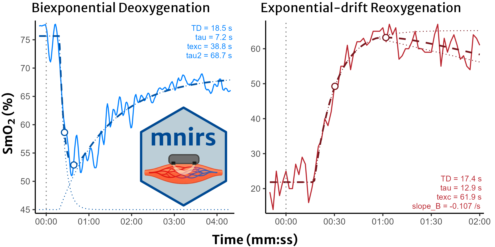
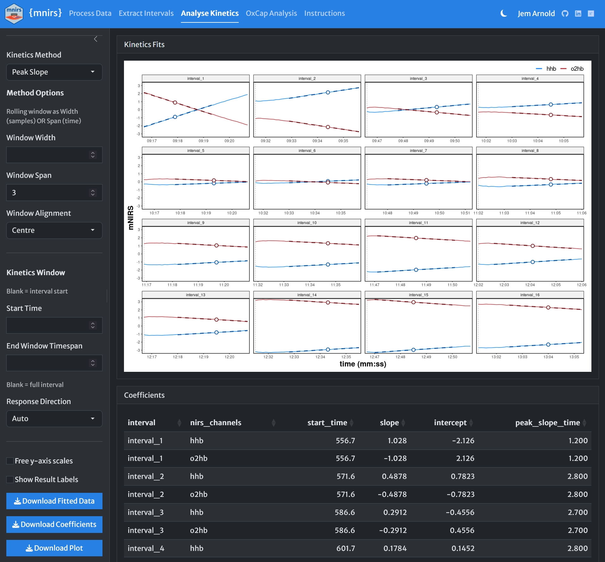

```{r}
#| echo: false
#| code-fold: true

library(mnirs)
library(ggplot2)
library(dplyr)
library(ggpubr)
library(purrr)

options(pillar.print_max = 5, pillar.print_min = 5, mnirs.verbose = FALSE)

theme_set(theme_mnirs())
```

## Post 1 — Intro

{mnirs} R package for muscle NIRS data🦵🔦 updated on CRAN to 0.8.0

`analyse_kinetics()` is here!

Fit oxygenation kinetics with advanced models. `plot()` results & fitted data automatically

No-code analysis also in the {mnirs} shiny app 🔗 👇 

1/5🧵 #rstats #nirs

```{r}
#| eval: false
#| code-fold: true
#| fig-asp: 0.5
intervals <- readRDS(
    r"(C:\R-Projects\mnirs\tests\testthat\testdata\5-1_intervals_short.rds)"
)


c(
    intervals[grepl("^deoxy", names(intervals))][1],
    intervals[grepl("^reoxy", names(intervals))][3]
) |>
    lapply(\(.df) {
        names(.df)[names(.df) %in% c("SmO2 Live", "smo2_right_vl")] <- "smo2"
        subset(.df, time >= -10)
    }) -> df_list


deoxy_results <- analyse_kinetics(
    df_list[[1]],
    nirs_channels = smo2,
    method = "biexponential"
)

reoxy_results <- analyse_kinetics(
    df_list[[2]],
    nirs_channels = smo2,
    method = "exponential-drift",
    model_fallback = FALSE
)

hex <- png::readPNG(
    r"(C:\R-Projects\mnirs\man\figures\mnirs-hex.png)",
    native = TRUE
)

ggarrange(
    plot(deoxy_results, time_labels = TRUE, components = TRUE) +
        rremove("xylab") +
        annotation_custom(
            grid::rasterGrob(hex, x = .75, y = .3, width = .45),
            xmin = -Inf, xmax = Inf, ymin = -Inf, ymax = Inf
        ),
    plot(reoxy_results, time_labels = TRUE, components = TRUE) +
        rremove("xylab") +
        scale_colour_manual(
            name = NULL,
            values = c(smo2 = palette_mnirs("dark red"))
        ),
    ncol = 2,
    nrow = 1,
    widths = c(0.48, 0.52),
    legend = "none"
) |>
    annotate_figure(
        top = text_grob(
            "Biexponential Deoxygenation                      Exponential-drift Reoxygenation",
            size = 16,
            face = "plain",
            hjust = 0.52,
            family = "Merriweather Sans"
        ),
        bottom = text_grob(
            "Time (mm:ss)",
            size = 16,
            face = "bold",
            family = "Merriweather Sans"
        ),
        left = text_grob(
            "SmO₂ (%)",
            size = 16,
            face = "bold",
            rot = 90,
            family = "Merriweather Sans"
        )
    ) +
ggview::canvas(width = 220, height = 220 * 0.5, units = "mm", dpi = 300)

ggsave(
    filename = r"(C:\R-Projects\mnirs\vignettes\articles\figures\socials-0.8.0-figure1.png)",
    width = 220,
    height = 220 * 0.5,
    units = "mm",
    bg = "white",
    dpi = 300
)
```



[2-panel plot showing observed muscle near-infrared spectroscopy (mNIRS) SmO2 tracings at the onset and end of an exercise interval, with fitted lines from analysing kinetics. Plot titles: "Biexponential Deoxygenation; Exponential-drift Reoxygenation". Plot 1 starts at 75% SmO2, rapidly deoxygenates to 50% in under 1-min, then gradually recovers toward a stable plateau around 65% over the 4-min work interval. Biexponential coefficients labelled in top right corner. Hex icon for {mnirs} R-package laid over bottom right. Plot 2 starts at 20% SmO2, rapidly reoxygenates to a peak at 65% by around 1-min, then gradually drifts linearly down toward 60% by the end of the 2-min recovery interval. Exponential-drift coefficients labelled in the bottom right corner. Points plotted over each fitted line at the MRT (exponential time-delay + time constant), and the excursion point where the response changes direction and the second-phase kinetics takes over]{style="font-size: 0.75em;"}


------------------------------------------------------------------------

## Post 2 — `analyse_kinetics()`

2/5 `analyse_kinetics()` takes a data frame or list of dfs and analyses every NIRS channel in every interval

Kinetic models include fractional response time, peak slope, and one- & two-phase exponential & sigmoidal family curves

Raw file read to fitted curve in one pipeline

Read the raw file to curve fitting in one pipeline

```{r}
#| eval: false

## work onset deoxygenation during exercise
read_mnirs(
    file_path     = moxy_intervals,
    nirs_channels = c(smo2 = "smo2_left_VL"),
    event_channel = "Lap",
) |>
    extract_intervals(
        start     = by_lap(5, 7, 9, 11, 13, 15),
        span      = c(-30, 240),
        zero_time = TRUE
    ) |>
    analyse_kinetics(method = "biexponential") |>
    print() |>
    plot()
#>
#> Biexponential Two-Phase Kinetics
#>     Model Coefficients:
#>     interval nirs_channels     A     B    TD   tau   MRT  texc    B2  tau2
#> 1 interval_1          smo2 76.62 50.14 19.64 2.261 21.90 27.48 79.50 72.27
#> 2 interval_2          smo2 86.40 55.12 16.75 8.516 25.27 34.35 82.47 36.16
#> 3 interval_3          smo2 87.93 63.93 23.60 9.015 32.61 46.20 79.61 42.40
#> 4 interval_4          smo2 88.27 29.80 18.81 22.88 41.69 97.28 67.94 28.04
#> 5 interval_5          smo2 90.92 46.24 18.13 20.06 38.18 143.3 61.72 25.29
#> 6 interval_6          smo2 91.07 54.37 18.50 16.94 35.44 98.34    NA    NA
```

```{r}
#| echo: false

read_mnirs(
    file_path = r"(C:\OneDrive - UBC\5-1 Assessments\Processed Data\13-2_2021-09-30-data.xlsx)",
    nirs_channels = c(smo2 = "smo2_left_VL"),
    event_channel = "Lap",
) |>
    extract_intervals(
        start = by_lap(5, 7, 9, 11, 13, 15),
        span = c(-31, 240),
        zero_time = TRUE
    ) |>
    analyse_kinetics(method = "biexponential") |>
    (\(.r) {
        .r$coefficients[c("model", "k")] <- NULL
        .r
    })() |>
    plot()
```


[Code excerpt reading a file with "smo2" nirs_channel, applying a Butterworth smoothing filter, extracting intervals from lap integers, and analysing exercise onset deoxygenation kinetics, printing formatted table of model coefficients for 6 intervals of smo2 nirs channel, and plotting a 6-panel figure with observed and fitted data, labels printed in the plot. All in a single function pipeline:
read_mnirs(file_path = moxy_intervals, nirs_channels = c(smo2 = "smo2_left_VL"), event_channel = "Lap", ) |> filter_mnirs(method = "butterworth", order = 2, W = 0.2) |> extract_intervals(start = by_lap(5, 7, 9, 11, 13, 15), span = c(-40, 240), zero_time = TRUE) |> analyse_kinetics(method = "biexponential") |> print() |> plot()]{style="font-size: 0.75em;"}


------------------------------------------------------------------------

<!-- ## Post 3 — Compare models & diagnostics

3/5 Most args accept per-channel & per-interval lists. Fit diagnostics (r2, rmse, AIC/BIC…) are returned in `results$diagnostics` to compare models

e.g. PIONIRS reoxygenation after occlusion: monoexponential vs two-phase exponential_drift vs biexponential

(two-phase methods experimental ⚠️)

```{r}
#| echo: false

## PIONIRS occlusion: blood volume corrected deoxy[haem] reoxygenation
df_reoxy <- read_mnirs(example_mnirs("pionirs")) |>
    create_mnirs_data(
        nirs_channels = c(o2hb = "O2Hb", hhb = "HHb", thb = "THb"),
        time_channel = c(time = "Time"),
        event_channel = c(labels = "TagLabel")
    ) |>
    filter_mnirs(method = "butterworth", order = 2, fc = 0.05) |>
    correct_blood_volume(
        oxy_channel = o2hb,
        deoxy_channel = hhb,
        total_channel = thb
    ) |>
    extract_intervals(
        nirs_channels = hhb,
        start = by_label("Recovery"),
        span = c(0, 300)
    )
```

```{r}
#| fig-alt: >
#|   Line plot of blood-volume-corrected deoxyhaemoglobin (hhb) against time
#|   in minutes and seconds during 300 seconds of recovery after an arterial
#|   occlusion. The observed signal falls rapidly from a high plateau at cuff
#|   release, undershoots below baseline during reactive hyperaemia, then
#|   drifts slowly back upward. A fitted two-phase exponential-drift curve
#|   overlays the data, with its fast monoexponential and slow linear drift
#|   components drawn separately as lighter lines. A text label reports the
#|   fitted time constant tau and time delay TD in seconds.

## fit three models to the same reoxygenation interval
fit_monoexp <- analyse_kinetics(
    df_reoxy, method = "monoexponential", end_window = 30
)
fit_drift <- analyse_kinetics(
    df_reoxy, method = "exponential_drift", end_window = 180
)
fit_biexp <- analyse_kinetics(
    df_reoxy, method = "biexponential"
)

## compare fit diagnostics (mind n_obs & n_params!)
rbind(
    monoexponential = fit_monoexp$diagnostics,
    exponential_drift = fit_drift$diagnostics,
    biexponential = fit_biexp$diagnostics
)

plot(fit_drift, time_labels = TRUE, components = TRUE)
``` 
-->

------------------------------------------------------------------------

## Post 3 — OxCap analysis

3/5 Muscle oxidative capacity from repeated occlusions is done with two recursive `analyse_kinetics()` calls:

1\. Find “peak_slopes” during occlusions\
2\. Fit slopes with “monoexponential” to estimate recovery constant k

Use `correct_blood_volume()` to normalise Δtotal[haem] first

```{r}
#| eval: false

occlusion_intervals |> 
    analyse_kinetics(
        nirs_channels = hhb,
        method        = "peak_slope",
        span          = 3        ## peak 3-sec slope per occlusion
    ) |>
    analyse_kinetics(
        nirs_channels = slope,   ## recursive fit through the slopes
        time_channel  = peak_slope_time,
        method        = "monoexponential",
        use_TD        = FALSE,
        group_intervals = list(
            trial1    = 1:16,    ## specify two discrete trials
            trial2    = 17:32    ## by interval sample number
        ),
        zero_time     = TRUE
    ) |> 
    print() |> 
    plot()
#> 
#> Monoexponential One-Phase Kinetics
#>     Model Coefficients:
#>   interval nirs_channels     A      B TD   tau       k   MRT
#> 1   trial1     hhb_slope 1.051 0.2104 NA 19.33 0.05174 19.33
#> 2   trial2     hhb_slope 1.034 0.1666 NA 15.39 0.06496 15.39
```

```{r}
#| echo: false
#| fig-asp: 0.5

read_mnirs(
    file_path = example_mnirs("portamon-oxcap"),
    nirs_channels = c(thb = 2, hhb = 3, o2hb = 4),
    event_channel = "labels"
) |>
    correct_blood_volume(
        oxy_channel = o2hb,
        deoxy_channel = hhb,
        total_channel = thb ## normalise ΔTHb to zero
    ) |>
    extract_intervals(
        ## 5s occlusions labelled
        start = by_label("Occlusion"),
        span = c(1, 5) ## extract 1s after each inflation
    ) |>
    analyse_kinetics(
        nirs_channels = hhb,
        method = "peak_slope",
        span = 3 ## peak 3-sec slope per occlusion
    ) |>
    analyse_kinetics(
        nirs_channels = slope, ## recursive fit through the slopes
        time_channel = peak_slope_time,
        method = "monoexponential",
        use_TD = FALSE,
        group_intervals = list(
            trial1 = 1:16, ## specify two discrete trials
            trial2 = 17:32 ## by interval sample number
        ),
        zero_time = TRUE
    ) -> oxcap

## label tau & k (min^-1) per trial
coef_labels <- with(
    oxcap$coefficients,
    data.frame(
        interval = interval,
        label = sprintf("tau = %.1f s\nk = %.1f min⁻¹", tau, k * 60)
    )
)

plot(oxcap, time_labels = TRUE, points = TRUE, labels = FALSE) +
    labs(y = "HHb slope (μM/s)") +
    theme(legend.position = "none") +
    geom_text(
        data = coef_labels,
        aes(label = label),
        x = Inf,
        y = Inf,
        hjust = 1.1,
        vjust = 1.3
    )
```


[Two-panel plot with observed values and fitted curves from two trials of repeated occlusions; a protocol to estimate muscle oxidative capacity from the recovery rate constant (k) of deoxy[haem] (HHb) after a brief exercise stimulus. y-axis values are HHb slope (μM/s). x-axis is time (0-03:30). Every point is the peak 3-sec slope during an occlusion. The first slope in each trial's first occlusion starts around 1.0 and declines exponentially toward ~0.2. A monoexponential function without a time-delay parameter is fit to the trials, and the rate constants are reported; k = 3.1 & 3.9 min^-1 for each trial, respectively (time constant tau = 19.3 & 15.4 sec, respectively).]{style="font-size: 0.75em;"}

------------------------------------------------------------------------

## Post 4 — No-code online Shiny app

4/5 Rapidly read ➡️ process ➡️ analyse ➡️ visualise ➡️ download your mNIRS data with the online Shiny app. No coding required

I want new NIRS users to have access to gold-standard methodology, without reinventing from scratch

https://jemarnold-mnirs-app.share.connect.posit.cloud/



[Screenshot of mnirs Shiny app "Analyse Kinetics" page; showing 16x 5sec occlusion intervals with "o2hb" and "hhb" NIRS channels in each. "Peak Slopes" analysis method is selected with a timespan looking for the peak 3-sec slope in each occlusion. Alignment is "centred" so that the "peak_slope_time" coefficient is returned at the centre of each slope. Response direction is "auto", correctly identifying negative slopes in oxy[haem] and positive in deoxy[haem] during occlusion, since blood flow is zero. Slopes are steepest in "interval_1" and progressively less steep as recovery proceeds. Coefficients returned in a table are: interval number, nirs_channel (o2hb or hhb), start_time (of each occlusion), slope (/sec), intercept (for each linear regression model), and peak_slope_time. The "slope" and "peak_slope_time" will be piped forward into a "monoexponential" analysis to estimate the recovery rate constant, a proxy for muscle oxidative capacity]{style="font-size: 0.75em;"} 


------------------------------------------------------------------------

## Post 5 — links

5/5 {mnirs} 0.8.0 available now on CRAN 🧑‍💻:

`install.packages("mnirs")`

Package site & articles with much more detail: https://jemarnold.github.io/mnirs/

OxCap analysis, examples from the new PIONIRS mNIRS device, microvascular responsiveness assessment, and more coming

You're bound to break things, let me know when you do!
